# GuruJi — Project Guide 🐼

A beginner-friendly tour of this codebase. Everything below is taken from the actual code. Where something is missing or unclear, it says so.

> **How to read the diagrams:** every diagram is a ```mermaid block. See the last section, [How to view the diagrams](#how-to-view-the-diagrams-in-vs-code).

---

## 1. Project in one line

**GuruJi is a personal DSA (Data Structures & Algorithms) training app.** It watches how you solve coding problems, works out what you are weak at, and tells you exactly what to practise next.

It is built for **people preparing for coding interviews**, from beginners to advanced, who want a coach rather than just a list of questions.

- **DSA** = Data Structures and Algorithms, the topics coding interviews test (arrays, graphs, dynamic programming…).
- The core promise, from [docs/README.md](docs/README.md): *"This app knows what I am weak at and tells me exactly what I should practise next."*

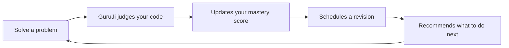

This is the learning loop the whole app is built around. Every feature below feeds one step of this circle.

---

## 2. USP (Unique Selling Points)

A **USP** is what makes a product different from its competitors.

| # | What makes it different | Where it lives |
|---|---|---|
| 1 | **A real mastery score per topic and pattern.** It combines accuracy, retention, difficulty, pattern coverage and speed, and subtracts points for heavy hint use. One lucky solve does not count as mastery. | [apps/api/src/mastery/mastery.ts](apps/api/src/mastery/mastery.ts), [apps/api/src/mastery/mastery-weights.ts](apps/api/src/mastery/mastery-weights.ts) |
| 2 | **"What next?" recommendation engine.** It scores candidate problems by revision urgency, weakness, difficulty fit, pattern gaps and prerequisites, and explains *why* in plain words. | [apps/api/src/recommendations/scoring.ts](apps/api/src/recommendations/scoring.ts), [apps/api/src/recommendations/ranking.ts](apps/api/src/recommendations/ranking.ts) |
| 3 | **Spaced-repetition revision for coding problems.** A ladder of 1 → 3 → 7 → 14 → 30 → 60 → 120 days, adjusted by how the last attempt went. | [apps/api/src/revision/scheduler.ts](apps/api/src/revision/scheduler.ts) |
| 4 | **Your code runs in a locked-down sandbox.** Each test case gets its own Docker container: no network, capped memory and CPU, read-only disk, non-root user, all Linux capabilities dropped. | [apps/code-runner/src/sandbox/docker.ts](apps/code-runner/src/sandbox/docker.ts) |
| 5 | **An AI mentor that holds back the answer.** Hints come in levels. Curated hints are used before the AI is asked. AI output is validated against a schema, and usage is capped per user. | [apps/api/src/ai/ai.service.ts](apps/api/src/ai/ai.service.ts), [packages/ai/src/](packages/ai/src/) |
| 6 | **A mistake journal.** You log *why* a submission failed, and GuruJi finds patterns in your mistakes. | [apps/api/src/mastery/mistakes.service.ts](apps/api/src/mastery/mistakes.service.ts) |
| 7 | **Mock contests.** Three problems picked from your weak topics, a server-enforced clock, and a report that names your weak area. | [apps/api/src/contests/](apps/api/src/contests/) |
| 8 | **An algorithm visualizer.** Watch 27 algorithms (sorts, trees, graphs, DP) run step by step. | [packages/algorithms/src/registry.ts](packages/algorithms/src/registry.ts) |
| 9 | **Badges that never affect learning.** Twelve tiered badges. A test fails the build if any learning engine ever imports them. | [apps/api/src/achievements/boundary.spec.ts](apps/api/src/achievements/boundary.spec.ts) |
| 10 | **Live verdicts.** Results are pushed to the browser over a WebSocket, with a polling fallback if the socket drops. | [apps/api/src/realtime/events.gateway.ts](apps/api/src/realtime/events.gateway.ts), [apps/web/src/components/problems/use-submission.ts](apps/web/src/components/problems/use-submission.ts) |

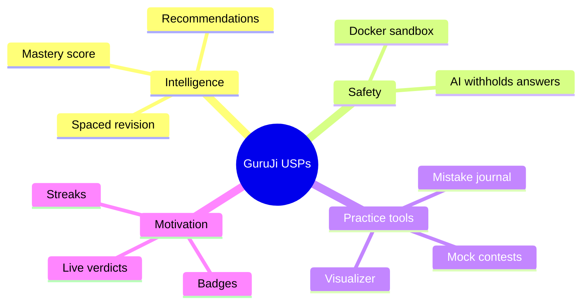

The USPs group into four themes. The intelligence layer is the heart of the product; the rest supports it.

---

## 3. Tech Stack

A **tech stack** is the set of languages and tools a project is built with.

| Layer | Technology | What it means / why it is used | Where |
|---|---|---|---|
| Language | **TypeScript** | JavaScript with types, so many bugs are caught before the code runs. Strict mode is on. | [packages/config/tsconfig/base.json](packages/config/tsconfig/base.json) |
| Monorepo | **pnpm workspaces** | One repository holding several apps and shared packages. pnpm is a fast package manager. | [pnpm-workspace.yaml](pnpm-workspace.yaml), [package.json](package.json) |
| Frontend | **Next.js 16 (App Router) + React 19** | Next.js is a React framework that handles pages, routing and server rendering. | [apps/web/](apps/web/) |
| Styling | **Tailwind CSS 4**, Radix UI | Tailwind: utility CSS classes. Radix: accessible building blocks such as dialogs and tabs. | [apps/web/src/styles/](apps/web/src/styles/) |
| Frontend data | **TanStack Query**, **Zustand** | TanStack Query fetches and caches server data; Zustand is a small store for local state. | [apps/web/src/components/providers.tsx](apps/web/src/components/providers.tsx), [apps/web/src/stores/](apps/web/src/stores/) |
| Code editor | **Monaco** | The editor that powers VS Code, bundled locally with no CDN. | [apps/web/src/components/editor/](apps/web/src/components/editor/) |
| Charts / 3D | **Recharts**, **three.js** (react-three-fiber) | Charts on the analytics page; a 3D robot scene on the landing page. | [apps/web/src/components/analytics/](apps/web/src/components/analytics/), [apps/web/src/components/RobotScene.tsx](apps/web/src/components/RobotScene.tsx) |
| Backend | **NestJS 11** on Express | A structured Node.js server framework with modules, controllers and services. | [apps/api/](apps/api/) |
| Database | **PostgreSQL 17** | A reliable relational (table-based) database. | [docker-compose.yml](docker-compose.yml) |
| ORM | **Prisma 7** | An ORM (Object-Relational Mapper) lets you query the database with TypeScript instead of raw SQL. | [packages/database/prisma/schema.prisma](packages/database/prisma/schema.prisma) |
| Cache / queue | **Redis 7** + **BullMQ** | Redis is a fast in-memory store. BullMQ builds job queues on top of it. | [apps/api/src/redis/](apps/api/src/redis/), [apps/api/src/execution/submission-queue.service.ts](apps/api/src/execution/submission-queue.service.ts) |
| Realtime | **Socket.IO** | WebSockets: a live two-way connection, so the server can push verdicts. | [apps/api/src/realtime/events.gateway.ts](apps/api/src/realtime/events.gateway.ts) |
| Sandbox | **Docker** | Runs untrusted user code in isolated containers. | [docker/sandbox/](docker/sandbox/), [apps/code-runner/](apps/code-runner/) |
| AI | **Groq** (`groq-sdk`) | A hosted LLM (Large Language Model) API. Models are set by env (`openai/gpt-oss-20b` and `-120b`). | [packages/ai/src/provider.ts](packages/ai/src/provider.ts) |
| Validation | **Zod**, class-validator | Check that incoming data has the right shape. | [packages/types/src/](packages/types/src/), [apps/api/src/app-setup.ts](apps/api/src/app-setup.ts) |
| Auth | **JWT**, **argon2** | JWT: signed login tokens. argon2id: a slow-on-purpose password hash. | [apps/api/src/auth/](apps/api/src/auth/) |
| Logging | **pino** (nestjs-pino) | Fast JSON logs with a request id on every line. | [apps/api/src/app.module.ts](apps/api/src/app.module.ts) |
| Testing | **Vitest**, **Supertest**, **Playwright**, **axe-core** | Unit tests, API tests, real-browser tests and accessibility scans. | `*.spec.ts`, [apps/api/test/](apps/api/test/), [apps/web/e2e/](apps/web/e2e/) |
| Quality | **ESLint**, **Prettier** | A linter that finds bad patterns, and an auto-formatter. | [packages/config/](packages/config/) |

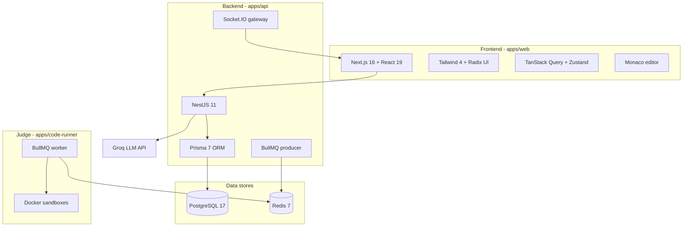

The frontend only talks to the API. The API is the only part that writes to the database. The code runner talks to Redis and Docker, never to the database.

---

## 4. Folder Structure

```mermaid
graph TD
    ROOT["claude-projects/ - repo root"]
    ROOT --> APPS["apps/ - runnable programs"]
    ROOT --> PKGS["packages/ - shared libraries"]
    ROOT --> DOCS["docs/ - design documents"]
    ROOT --> DOCKER["docker/sandbox/ - Dockerfiles for c, cpp, python, javascript"]
    ROOT --> CFG["package.json, pnpm-workspace.yaml, docker-compose.yml, .env.example"]
    ROOT --> TODO["TODO.md - phase checklist"]
    ROOT --> PLAN[".planning/ - feature specs and plans"]

    APPS --> WEB["web/ - Next.js frontend"]
    APPS --> API["api/ - NestJS backend"]
    APPS --> RUN["code-runner/ - judge worker"]

    WEB --> WAPP["src/app/ - pages: marketing, auth, app"]
    WEB --> WCOMP["src/components/ - UI by feature"]
    WEB --> WLIB["src/lib/ - api client, socket"]
    WEB --> WSTORE["src/stores/ - Zustand stores"]
    WEB --> WPROXY["src/proxy.ts - CSP header and auth redirects"]
    WEB --> WE2E["e2e/ - Playwright browser tests"]

    API --> AAUTH["src/auth/ - login, tokens, passwords"]
    API --> ACONT["src/content/ - topics, problems, roadmap"]
    API --> AEXEC["src/execution/ - submissions and queue"]
    API --> AMAST["src/mastery/ - mastery, analytics, mistakes"]
    API --> AREV["src/revision/ - spaced repetition"]
    API --> AREC["src/recommendations/ - what next"]
    API --> AAI["src/ai/ - mentor endpoints"]
    API --> ACON["src/contests/ - mock contests"]
    API --> AACH["src/achievements/ - badges"]
    API --> AOTHER["src/editor, realtime, health, redis, common, config"]
    API --> ATEST["test/ - end-to-end API tests"]

    RUN --> RW["src/worker.ts - pulls jobs"]
    RUN --> RJ["src/judge.ts - runs every test case"]
    RUN --> RS["src/sandbox/ - docker run with limits"]

    PKGS --> PDB["database/ - Prisma schema, migrations, seed"]
    PKGS --> PTYPES["types/ - Zod schemas shared by all apps"]
    PKGS --> PAI["ai/ - Groq provider, prompts, output schemas"]
    PKGS --> PALG["algorithms/ - visualizer step recorders"]
    PKGS --> PCFG["config/ - shared tsconfig, eslint, prettier"]
    PKGS --> PUI["ui/ - EMPTY folder, no package.json"]
```

`apps/` holds the three programs that run. `packages/` holds code they share. Note that `packages/ui/` exists but is **empty**.

Other root items worth knowing:
- `phases.md`, `screenshots/`, `sharp-*.png`, `model-3d/` — working files and images, not app code.
- `CLAUDE.md` — working rules for the AI assistant used on this project.
- There is **no root `README.md`**. The docs index is [docs/README.md](docs/README.md), and its header ("implementation has not started") is **out of date**.

---

## 5. High-Level Architecture

**Architecture** = the big picture of how the parts connect.

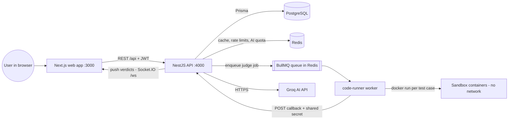

- **The API is the only database writer.** The runner has no database credentials. It reports results back to `POST /api/internal/submissions/callback`, protected by a shared secret ([apps/api/src/execution/guards/runner-secret.guard.ts](apps/api/src/execution/guards/runner-secret.guard.ts)).
- **Redis does four jobs:** content cache, rate-limit counters, AI usage quota, and the job queue.

---

## 6. Complete Workflow (user's view)

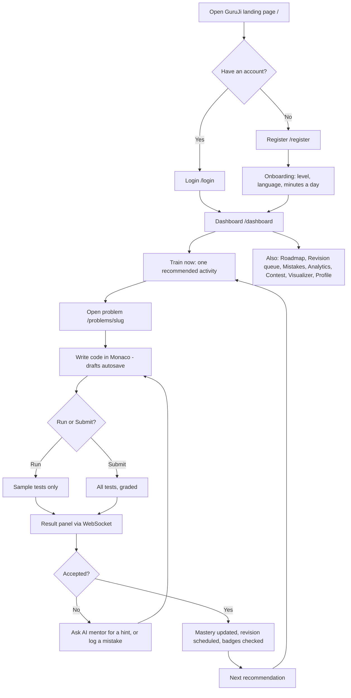

The main path is **dashboard → recommended problem → code → verdict → updated plan**. Other pages hang off the dashboard via the side rail ([apps/web/src/components/app-shell.tsx](apps/web/src/components/app-shell.tsx)).

---

## 7. Request / Data Flow

### 7a. Submitting code

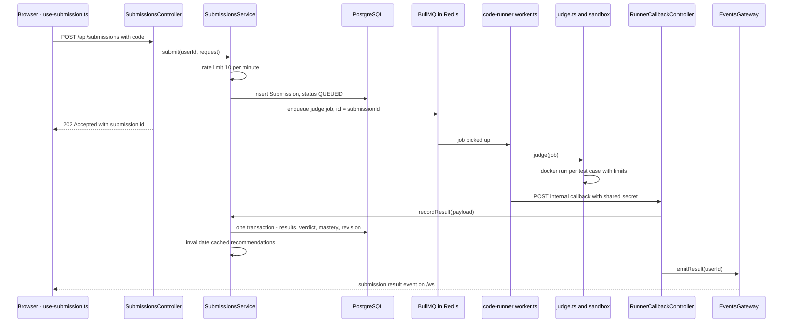

Files: [submissions.controller.ts](apps/api/src/execution/submissions.controller.ts) → [submissions.service.ts](apps/api/src/execution/submissions.service.ts) → [submission-queue.service.ts](apps/api/src/execution/submission-queue.service.ts) → [worker.ts](apps/code-runner/src/worker.ts) → [judge.ts](apps/code-runner/src/judge.ts) → [runner-callback.controller.ts](apps/api/src/execution/runner-callback.controller.ts) → [events.gateway.ts](apps/api/src/realtime/events.gateway.ts).

Mastery ([progress.service.ts](apps/api/src/mastery/progress.service.ts)) and revision ([revision.service.ts](apps/api/src/revision/revision.service.ts)) are updated **inside the same database transaction** as the verdict. They either both happen or neither does. If the socket misses the event, the browser polls every few seconds as a fallback.

### 7b. Login and staying signed in

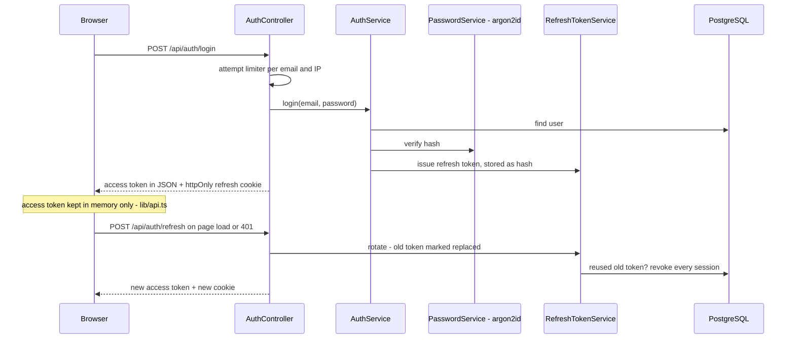

The short-lived **access token** (15 min) lives only in memory, so page scripts cannot steal it from storage. The long-lived **refresh token** (30 days) is in an `httpOnly`, `SameSite=Strict` cookie ([auth.controller.ts](apps/api/src/auth/auth.controller.ts)). Showing a spent refresh token again is treated as theft, and all of that user's sessions are revoked ([refresh-token.service.ts](apps/api/src/auth/refresh-token.service.ts)).

---

## 8. Data Model / Database Diagram

28 tables are defined in [packages/database/prisma/schema.prisma](packages/database/prisma/schema.prisma). Every id is a UUID v7, and every timestamp is UTC (`timestamptz`). There are 11 migrations, in [packages/database/prisma/migrations/](packages/database/prisma/migrations/).

```mermaid
erDiagram
    User ||--o| Profile : has
    User ||--o{ RefreshToken : owns
    User ||--o{ Submission : makes
    User ||--o{ Draft : saves
    User ||--o{ Mistake : logs
    User ||--o{ RevisionItem : schedules
    User ||--o{ Recommendation : receives
    User ||--o{ UserTopicProgress : tracks
    User ||--o{ UserPatternProgress : tracks
    User ||--o{ AIConversation : chats
    User ||--o{ Contest : takes
    User ||--o{ UserAchievement : earns
    User ||--o{ StudySession : logs

    Topic ||--o{ TopicPrerequisite : needs
    Topic ||--o{ RoadmapNode : placed_in
    Topic ||--o{ ProblemTopic : tags
    Pattern ||--o{ ProblemPattern : tags
    Problem ||--o{ ProblemTopic : has
    Problem ||--o{ ProblemPattern : has
    Problem ||--o{ TestCase : checked_by
    Problem ||--o{ Hint : offers
    Problem ||--o{ Submission : receives

    Submission ||--o{ SubmissionResult : produces
    TestCase ||--o{ SubmissionResult : checked_in
    RevisionItem ||--o{ RevisionReview : history
    AIConversation ||--o{ AIMessage : contains
    Contest ||--o{ ContestProblem : includes
    Contest ||--o{ ContestSubmission : records
    Submission ||--o| ContestSubmission : linked

    User {
        uuid id PK
        string email
        string passwordHash
        enum role
        datetime deletedAt
    }
    Profile {
        uuid userId PK
        string displayName
        enum preferredLanguage
        enum experienceLevel
        int dailyGoalMinutes
        string timezone
    }
    Problem {
        uuid id PK
        string slug
        string title
        enum difficulty
        text statement
        json starterCode
        int timeLimitMs
        int memoryLimitMb
        enum reviewStatus
    }
    TestCase {
        uuid id PK
        text input
        text expectedOutput
        bool isSample
        bool isHidden
    }
    Submission {
        uuid id PK
        enum language
        text code
        enum status
        enum verdict
        bool isRun
        int hintsUsedAtSubmit
        int timeSpentMs
    }
    UserTopicProgress {
        uuid id PK
        int attempts
        int solved
        float masteryScore
    }
    RevisionItem {
        uuid id PK
        int intervalDays
        float ease
        enum state
        datetime dueAt
    }
    Recommendation {
        uuid id PK
        enum kind
        float score
        string reason
        datetime expiresAt
    }
    Contest {
        uuid id PK
        enum status
        datetime deadlineAt
        int score
        int maxScore
    }
    UserAchievement {
        uuid id PK
        string badge
        enum tier
        datetime unlockedAt
        datetime seenAt
    }
```

The diagram shows the main tables and their key fields. Every table also has `createdAt`/`updatedAt` columns; for the full field lists, open the schema file. A generated diagram of the whole database is also kept in [docs/erd.md](docs/erd.md).

### AI pipeline (the only "model" in the project)

GuruJi **does not train its own machine-learning model**. The "intelligence" is hand-written scoring formulas plus a hosted LLM for the mentor.

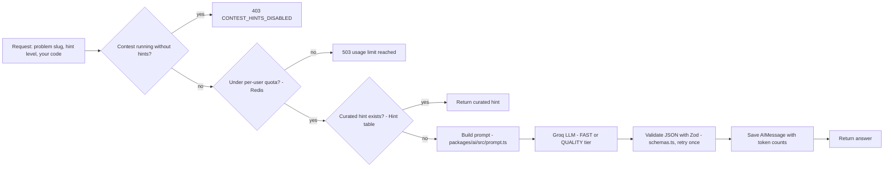

The flow is in [apps/api/src/ai/ai.service.ts](apps/api/src/ai/ai.service.ts). The provider is behind an `LLMProvider` interface ([packages/ai/src/provider.ts](packages/ai/src/provider.ts)), so Groq could be swapped for another provider in one class.

---

## 9. How each module is built

Backend modules follow one pattern: **controller** (receives the HTTP request) → **service** (business logic) → **Prisma** (database). Pure math lives in separate files with their own unit tests.

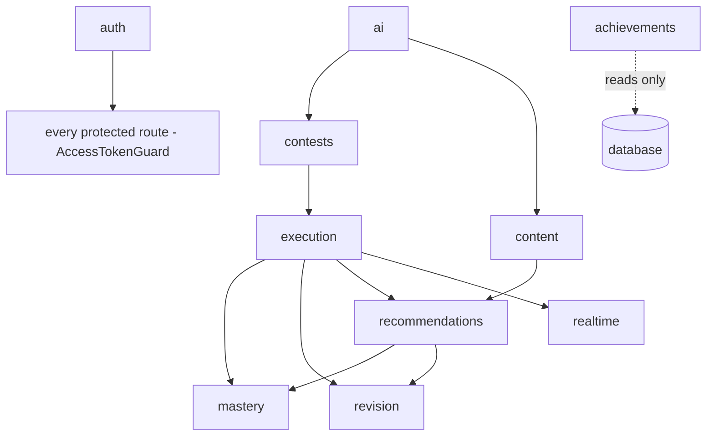

Arrows mean "uses". Achievements only reads data, and nothing imports it.

| Module | What it does | How it works | Files |
|---|---|---|---|
| **Auth** | Register, login, refresh, logout, `me`, onboarding | argon2id hashes; a blocklist of 1,257 common passwords; rotating refresh tokens; attempt limits per email and IP | [apps/api/src/auth/](apps/api/src/auth/) |
| **Content** | Topics, patterns, roadmap, problems, hints | Redis-cached reads with TTLs (topics 1 h, problem list 10 min); cursor pagination | [apps/api/src/content/](apps/api/src/content/) |
| **Editor (drafts)** | Autosaves your code per problem and language | `GET`/`PUT /problems/:slug/drafts` | [apps/api/src/editor/](apps/api/src/editor/), [apps/web/src/components/editor/use-drafts.ts](apps/web/src/components/editor/use-drafts.ts) |
| **Execution** | Run/Submit, submission history API, runner callback | Validate → save → enqueue. The result is recorded in one transaction | [apps/api/src/execution/](apps/api/src/execution/) |
| **Code runner** | Judges code | BullMQ worker; one container per test case; timeout enforced twice (inside with `ulimit cpu`, outside by killing the container); an orphan-container reaper | [apps/code-runner/src/](apps/code-runner/src/) |
| **Mastery & analytics** | Scores, dashboard numbers, activity, trends | Formula in `mastery.ts`, weights in `mastery-weights.ts`; a nightly 3 AM UTC job logs any drift | [apps/api/src/mastery/](apps/api/src/mastery/) |
| **Mistakes** | Mistake journal and pattern summary | `POST`/`GET /mistakes`, `GET /mistakes/patterns` | [apps/api/src/mastery/mistakes.service.ts](apps/api/src/mastery/mistakes.service.ts) |
| **Revision** | What is due, upcoming days, complete, respace | SM-2-style ease plus a fixed ladder; daily cap; user's local day | [apps/api/src/revision/](apps/api/src/revision/) |
| **Recommendations** | The ranked list and one "Train now" pick | Candidates (REVISION / WEAK_TOPIC / NEW_PATTERN) → weighted score → at most 2 per topic → plain-English reason | [apps/api/src/recommendations/](apps/api/src/recommendations/) |
| **AI mentor** | hint, explain, analyze-code, explain-wrong-answer, show-solution, generate-problem (admin only) | See the pipeline in section 8 | [apps/api/src/ai/](apps/api/src/ai/), [packages/ai/](packages/ai/) |
| **Contests** | Start, submit, finish, report | 3 problems from weak topics; one active contest per user (database index); the clock is the server's; scoring EASY 100 / MEDIUM 200 / HARD 300 | [apps/api/src/contests/](apps/api/src/contests/) |
| **Achievements** | 12 badges × up to 4 tiers | Metrics computed on read; unlocks stored once; "seen" acknowledgement | [apps/api/src/achievements/](apps/api/src/achievements/) |
| **Realtime** | Pushes verdicts | Socket.IO namespace `/ws`; JWT checked on connect; one room per user | [apps/api/src/realtime/events.gateway.ts](apps/api/src/realtime/events.gateway.ts) |
| **Health** | Liveness and readiness | `/health`, and `/health/ready`, which pings Postgres and Redis | [apps/api/src/health/](apps/api/src/health/) |
| **Visualizer** | 27 algorithms animated | Each algorithm records "steps"; the UI plays them back | [packages/algorithms/src/](packages/algorithms/src/), [apps/web/src/components/visualizer/](apps/web/src/components/visualizer/) |
| **Shared types** | One definition of every request and response | Zod schemas, built to CommonJS, imported by all three apps | [packages/types/src/](packages/types/src/) |

**Frontend pages** ([apps/web/src/app/](apps/web/src/app/)):

| Group | Pages |
|---|---|
| `(marketing)` | Landing `/` |
| `(auth)` | `/login`, `/register` |
| `(app)` | `/dashboard`, `/roadmap`, `/problems`, `/problems/[slug]`, `/revision`, `/mistakes`, `/analytics`, `/visualizer`, `/contest`, `/profile` |

The `(app)` pages share `loading.tsx` (skeletons), `error.tsx` and a `SessionGate` that restores your login ([apps/web/src/components/session-gate.tsx](apps/web/src/components/session-gate.tsx)).

---

## 10. What makes it production-ready

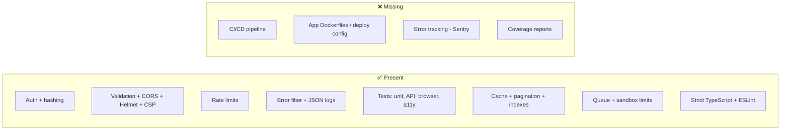

The strengths are in the code itself. The gaps are all about shipping and operating it.

### 🔐 Security & auth

| | Item | Where |
|---|---|---|
| ✅ | Passwords hashed with **argon2id**; login against an unknown email still does a hash check, so timing does not reveal which emails exist | [apps/api/src/auth/password.service.ts](apps/api/src/auth/password.service.ts) |
| ✅ | Common-password blocklist (1,257 entries) | [apps/api/src/auth/common-passwords.ts](apps/api/src/auth/common-passwords.ts) |
| ✅ | JWT access token (15 min) + rotating refresh token with reuse detection | [apps/api/src/auth/refresh-token.service.ts](apps/api/src/auth/refresh-token.service.ts) |
| ✅ | Refresh cookie is `httpOnly`, `SameSite=Strict`, and `Secure` in production | [apps/api/src/auth/auth.controller.ts](apps/api/src/auth/auth.controller.ts) |
| ✅ | Input validation: `ValidationPipe` rejects unknown fields; Zod schemas use `.strict()` | [apps/api/src/app-setup.ts](apps/api/src/app-setup.ts), [packages/types/src/](packages/types/src/) |
| ✅ | CORS allowlist from `CORS_ORIGINS`; Helmet security headers | [apps/api/src/app-setup.ts](apps/api/src/app-setup.ts) |
| ✅ | Content-Security-Policy with a per-request nonce and no `unsafe-eval` | [apps/web/src/proxy.ts](apps/web/src/proxy.ts) |
| ✅ | Rate limits: global per IP, login attempts, 10 submits/min, AI per-minute and daily token quota | [apps/api/src/common/guards/global-rate-limit.guard.ts](apps/api/src/common/guards/global-rate-limit.guard.ts), [apps/api/src/auth/rate-limit.service.ts](apps/api/src/auth/rate-limit.service.ts), [apps/api/src/ai/ai.service.ts](apps/api/src/ai/ai.service.ts) |
| ✅ | Small body limit (100 KB) on public routes | [apps/api/src/app-setup.ts](apps/api/src/app-setup.ts) |
| ✅ | Sandbox: `--network none`, memory, CPU and pids limits, read-only root, `--cap-drop ALL`, non-root user | [apps/code-runner/src/sandbox/docker.ts](apps/code-runner/src/sandbox/docker.ts) |
| ✅ | Env validated at startup (for example, JWT secrets must be ≥ 32 characters); `.env` is git-ignored | [apps/api/src/config/env.ts](apps/api/src/config/env.ts), [.env.example](.env.example) |
| ✅ | Ownership checks: every query filters by `userId` | For example, [apps/api/src/execution/submissions.service.ts](apps/api/src/execution/submissions.service.ts) |
| ❌ | Production secret manager (such as AWS Secrets Manager) — not configured | — |

### 🧯 Error handling & logging

| | Item | Where |
|---|---|---|
| ✅ | One global exception filter, one error envelope `{ error: { code, message, details, requestId } }` | [apps/api/src/common/filters/all-exceptions.filter.ts](apps/api/src/common/filters/all-exceptions.filter.ts), [packages/types/src/error.ts](packages/types/src/error.ts) |
| ✅ | pino JSON logs with an `x-request-id` correlation id; auth headers and cookies redacted | [apps/api/src/app.module.ts](apps/api/src/app.module.ts) |
| ✅ | Frontend error boundaries and retryable error states | [apps/web/src/app/(app)/error.tsx](apps/web/src/app/(app)/error.tsx), [apps/web/src/components/content/states.tsx](apps/web/src/components/content/states.tsx) |
| ✅ | Failed judge jobs go to a dead-letter path and report `INTERNAL_ERROR`, never a wrong verdict | [apps/code-runner/src/worker.ts](apps/code-runner/src/worker.ts) |
| ❌ | Error tracking: `SENTRY_DSN` is in `.env.example`, but no code uses it | [.env.example](.env.example) |

### ⚙️ Environment config

| | Item | Where |
|---|---|---|
| ✅ | One root `.env`, with a documented template | [.env.example](.env.example) |
| ✅ | `NODE_ENV` switches pretty logs and the `Secure` cookie flag | [apps/api/src/app.module.ts](apps/api/src/app.module.ts) |
| ✅ | Local Postgres and Redis via Docker Compose, with health checks, in UTC | [docker-compose.yml](docker-compose.yml) |
| ❌ | Separate production config (managed database, hosting) — the compose file says "production uses managed Postgres/Redis", but no such config exists in the repo | [docker-compose.yml](docker-compose.yml) |

### 🧪 Testing

Counted from the code: about **400 automated tests**.

| | Suite | Count | Where |
|---|---|---|---|
| ✅ | API unit tests (math, scheduler, scoring…) | ~125 tests in 12 files | `apps/api/src/**/*.spec.ts` |
| ✅ | API end-to-end tests (real database and Redis) | ~126 tests in 14 files | [apps/api/test/](apps/api/test/) |
| ✅ | Code runner (judge, adversarial programs, concurrency) | ~18 tests | [apps/code-runner/](apps/code-runner/) |
| ✅ | Algorithms and AI packages | ~55 + ~8 tests | [packages/algorithms/src/](packages/algorithms/src/), [packages/ai/src/](packages/ai/src/) |
| ✅ | Playwright browser tests, including accessibility (axe) and responsive checks | ~64 tests in 12 files | [apps/web/e2e/](apps/web/e2e/) |
| ✅ | Query-budget test: fails if a route starts making too many database queries | 1 suite | [apps/api/test/query-budget.e2e-spec.ts](apps/api/test/query-budget.e2e-spec.ts) |
| ❌ | Coverage measurement — not configured in any `vitest.config.mts` | — |
| ❌ | Frontend unit/component tests — the web app has only browser tests | — |

### ⚡ Performance

| | Item | Where |
|---|---|---|
| ✅ | Redis cache for content, with TTLs | [apps/api/src/content/content-cache.service.ts](apps/api/src/content/content-cache.service.ts) |
| ✅ | Cursor pagination on problem and submission lists | [apps/api/src/content/cursor.ts](apps/api/src/content/cursor.ts) |
| ✅ | Database indexes, starting with `userId`, on hot tables | [packages/database/prisma/schema.prisma](packages/database/prisma/schema.prisma) |
| ✅ | Async judging through a queue; bounded worker concurrency | [apps/code-runner/src/worker.ts](apps/code-runner/src/worker.ts) |
| ✅ | Lazy-loaded charts, skeleton loading, client query caching (30 s) | [apps/web/src/components/analytics/analytics-view.tsx](apps/web/src/components/analytics/analytics-view.tsx), [apps/web/src/components/providers.tsx](apps/web/src/components/providers.tsx) |

### 🚀 Scalability & deployment

| | Item | Where |
|---|---|---|
| ✅ | Stateless API (sessions in DB and cookies) — can run several copies | [apps/api/](apps/api/) |
| ✅ | Graceful shutdown hooks close the queue | [apps/api/src/app-setup.ts](apps/api/src/app-setup.ts) |
| ✅ | Sandbox images per language, with pinned tags and a build script | [docker/sandbox/](docker/sandbox/), [apps/code-runner/scripts/build-images.mjs](apps/code-runner/scripts/build-images.mjs) |
| ❌ | Dockerfiles for `web`, `api` and `code-runner` | — |
| ❌ | CI/CD (there is no `.github/workflows/`) | — |
| ❌ | Cloud or deploy config (no Railway, Vercel, Kubernetes or Terraform files) | — |

### 🧹 Code quality

| | Item | Where |
|---|---|---|
| ✅ | Strict TypeScript: `strict`, `noUncheckedIndexedAccess`, `exactOptionalPropertyTypes`, no unused locals | [packages/config/tsconfig/base.json](packages/config/tsconfig/base.json) |
| ✅ | Shared ESLint and Prettier config | [packages/config/eslint/](packages/config/eslint/), [prettier.config.mjs](prettier.config.mjs) |
| ✅ | Clear module boundaries; a test enforces one of them | [apps/api/src/achievements/boundary.spec.ts](apps/api/src/achievements/boundary.spec.ts) |
| ✅ | Design docs for every engine | [docs/](docs/) |

---

## 11. What's missing / what can be improved

```mermaid
flowchart TD
    H["🔴 High"] --> H1["Add CI: typecheck, lint, test, build on every push"]
    H --> H2["Add Dockerfiles and a deploy target for web, api, runner"]
    H --> H3["Wire error tracking - Sentry or similar"]
    H --> H4["Production secrets and managed Postgres/Redis config"]
    M["🟡 Medium"] --> M1["Coverage reports"]
    M --> M2["Problem status filter: solved, attempted, unsolved"]
    M --> M3["Submission history panel in the editor"]
    M --> M4["Grow the problem bank - 12 problems today"]
    L["🟢 Low"] --> L1["Root README.md; refresh docs/README.md header"]
    L --> L2["Remove or fill empty packages/ui"]
    L --> L3["Frontend component tests"]
```

**🔴 High**
1. **No CI pipeline.** Nothing checks the code automatically when you push. Add a GitHub Actions workflow that runs `pnpm typecheck`, `lint`, `test` and `build`.
2. **No way to deploy.** There are no Dockerfiles for the three apps and no hosting config.
3. **No error tracking.** In production, crashes would only show up in logs. `SENTRY_DSN` is reserved in [.env.example](.env.example) but unused.
4. **Production secrets and infrastructure.** Real secrets need a secret manager, and Postgres and Redis need managed hosting.

**🟡 Medium**
1. **Coverage is not measured.** There are many tests, but no report of how much code they cover.
2. **Problem status filter missing.** The code says it is absent on purpose, because it was deferred ([packages/types/src/content.ts](packages/types/src/content.ts)).
3. **Submission history panel missing** in the editor. The API exists (`GET /submissions?problemId=`), but no UI uses it.
4. **Small content set.** The live database has 12 problems, 14 topics and 12 patterns; recommendations get better with more.

**🟢 Low**
1. There is no root `README.md`, and [docs/README.md](docs/README.md) still says "implementation has not started".
2. `packages/ui/` is an empty folder.
3. The web app has browser tests but no small component tests.

---

## 12. How to run the project

**You need:** Node.js ≥ 22, pnpm ≥ 10, and Docker Desktop (running). These are from [docs/contributing.md](docs/contributing.md).

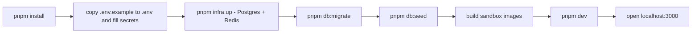

Run these steps once, in order. After that, only `pnpm infra:up` and `pnpm dev` are needed each day.

```bash
# 1. Install dependencies
pnpm install

# 2. Create your env file, then edit it:
#    set JWT_ACCESS_SECRET, JWT_REFRESH_SECRET and CODE_RUNNER_SHARED_SECRET
#    to long random strings (openssl rand -base64 48). GROQ_API_KEY is optional.
cp .env.example .env

# 3. Start Postgres and Redis in Docker
pnpm infra:up

# 4. Create the tables, then load topics, patterns and problems
pnpm db:migrate
pnpm db:seed

# 5. Build the sandbox images the judge runs code in (once)
pnpm --filter @guruji/code-runner images:build

# 6. Start web (:3000), api (:4000) and code-runner together
pnpm dev
```

Useful extras (from [package.json](package.json)):

| Command | What it does |
|---|---|
| `pnpm typecheck` / `pnpm lint` / `pnpm test` | Check types / style / run unit tests in every package |
| `pnpm build` | Full production build — the real check before a commit |
| `pnpm --filter @guruji/web test:e2e e2e/journey.spec.ts` | Run one browser test file |
| `pnpm db:studio` | Browse the database in Prisma Studio |
| `pnpm infra:down` | Stop the containers |

---

## 13. Quick Summary Diagram

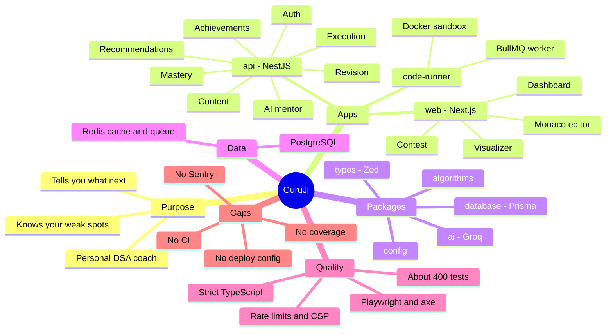

The whole project at a glance: what it is for, the three apps, the shared packages, where data lives, how quality is kept, and what is still missing.

---

## How to view the diagrams in VS Code

1. Open this file in VS Code.
2. Press **Ctrl+Shift+V** (Mac: **Cmd+Shift+V**) to open the Markdown preview, or **Ctrl+K V** to open it side by side.
3. VS Code's built-in preview does **not** draw Mermaid. Install the extension **"Markdown Preview Mermaid Support"** (`bierner.markdown-mermaid`) and reopen the preview.
4. GitHub also draws Mermaid automatically if you push this file.
