<div align="center">

# GuruJi

**A personal DSA training system that knows what you are weak at and tells you what to practise next.**

Not another website with DSA questions on it.


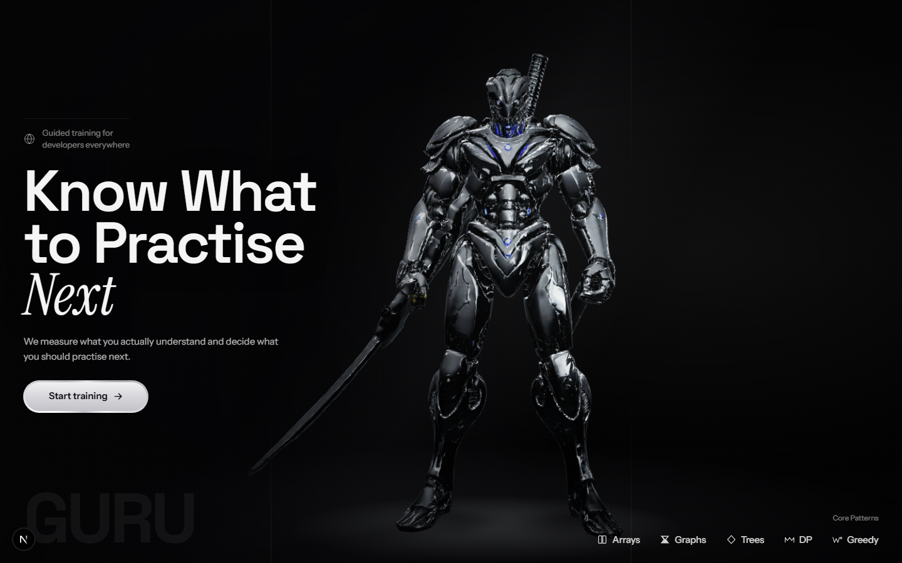

</div>

---

## Contents

- [The idea](#the-idea)
- [A tour of the app](#a-tour-of-the-app)
- [How it works](#how-it-works)
  - [Architecture](#architecture)
  - [Life of a submission](#life-of-a-submission)
  - [The mastery model](#the-mastery-model)
  - [The revision engine](#the-revision-engine)
  - [The recommendation engine](#the-recommendation-engine)
  - [The AI mentor](#the-ai-mentor)
  - [The sandbox](#the-sandbox)
- [Repository layout](#repository-layout)
- [Local setup](#local-setup)
- [Deploying for free](#deploying-for-free)
- [Further reading](#further-reading)

---

## The idea

Most practice sites count how many problems you solved. That number says very
little. Forty easy problems solved on the third try with hints is not mastery,
and eight hard graph problems solved cleanly is not weakness.

GuruJi is built around one loop. Every feature exists to feed it.

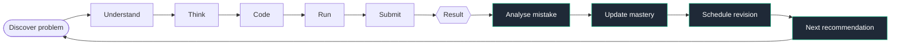
```mermaid
flowchart LR
    A([Discover problem]) --> B[Understand] --> C[Think] --> D[Code]
    D --> E[Run] --> F[Submit] --> G{{Result}}
    G --> H[Analyse mistake]
    H --> I[Update mastery]
    I --> J[Schedule revision]
    J --> K[Next recommendation]
    K --> A

    classDef engine fill:#1f2937,stroke:#10b981,color:#fff
    class H,I,J,K engine
```

The highlighted half is the part most sites skip. It is what turns a question
bank into a training system.

Three rules follow from it:

| Rule | Why |
|---|---|
| **Real code execution** | Every downstream signal comes from real verdicts. Fake results would poison mastery, revision and recommendations. |
| **Deterministic engines** | Mastery, revision and recommendation are plain, tested maths, not AI. They must be explainable and repeatable. |
| **The mentor never leads with the answer** | Hints come in levels. Leaning on them counts against mastery, honestly. |

---

## A tour of the app

### Train Now — one button, one decision

The dashboard asks one question: *what should I do next?* The answer can be a
revision that is due, a weak topic, a pattern you have never touched, or a timed
mock. Every suggestion says why it was picked.

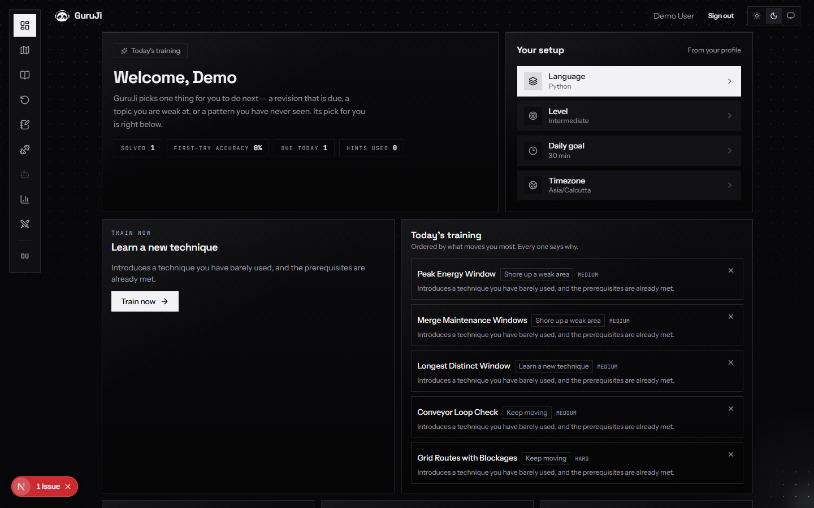

### Editor, real verdicts, and a mentor that holds back

Monaco editor with C, C++, Python and JavaScript. Code runs in a locked-down
Docker container per submission, and the verdict arrives live over a WebSocket.

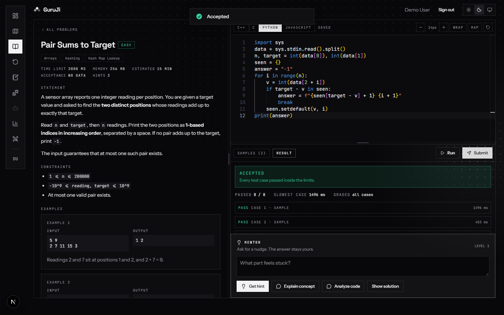

<table>
  <tr>
    <td width="50%">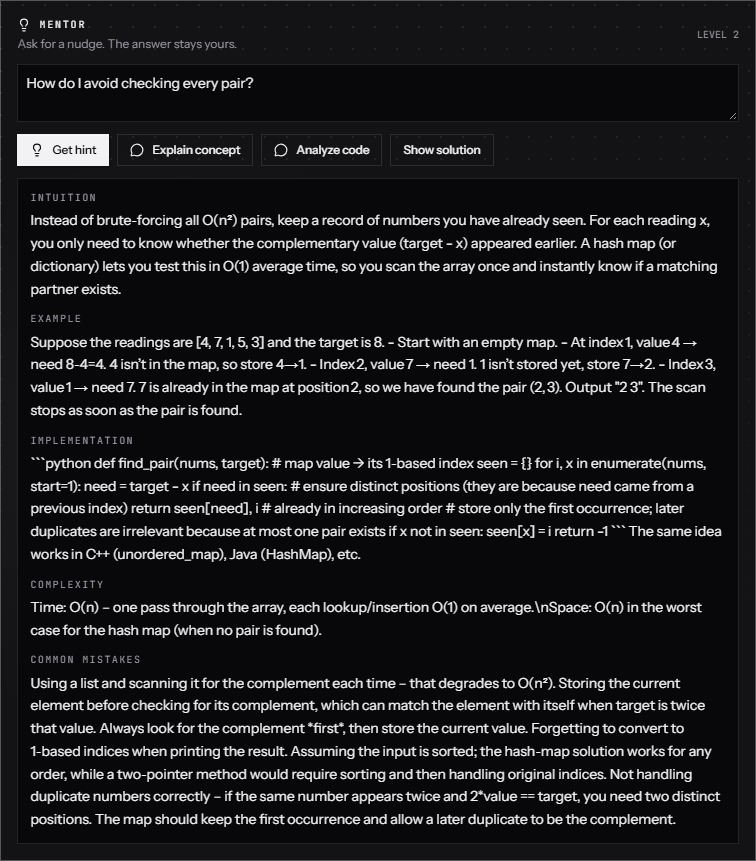</td>
    <td width="50%">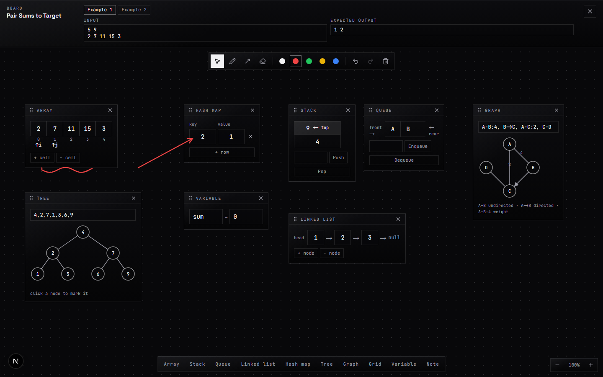</td>
  </tr>
  <tr>
    <td><b>Mentor.</b> Hint, explain concept, analyse code. The full solution sits behind a confirmation, and hint level counts against mastery.</td>
    <td><b>Board.</b> A whiteboard with live data-structure widgets, so you can dry-run before you type.</td>
  </tr>
</table>

### Remember what you learned

<table>
  <tr>
    <td width="50%">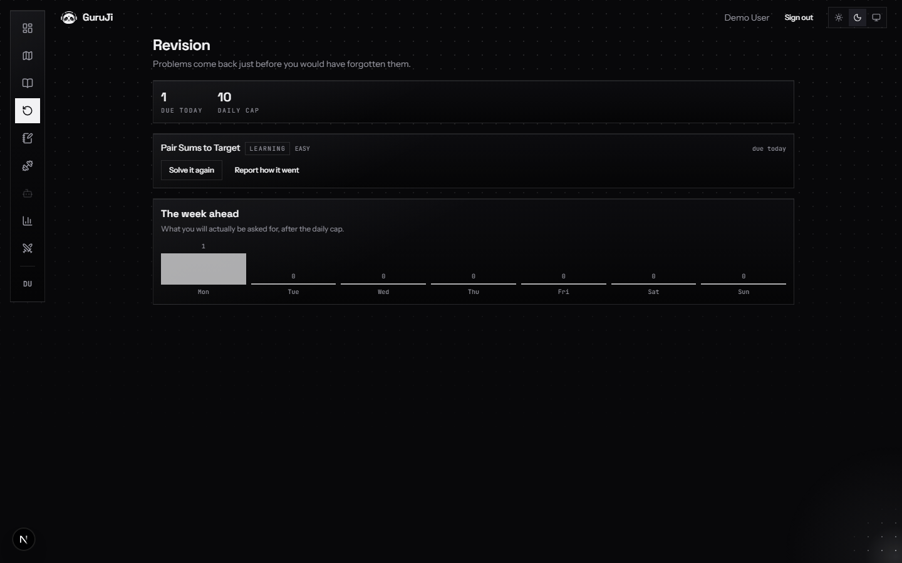</td>
    <td width="50%">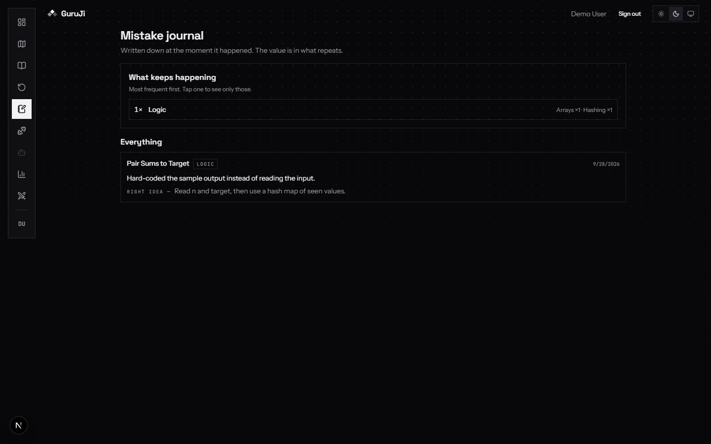</td>
  </tr>
  <tr>
    <td><b>Revision.</b> Spaced repetition tuned for problem solving. Problems return just before you would have forgotten them, with a daily cap.</td>
    <td><b>Mistake journal.</b> Written at the moment it happened, with the idea that fixes it. Grouped by what repeats.</td>
  </tr>
</table>

### See the shape of your progress

<table>
  <tr>
    <td width="50%">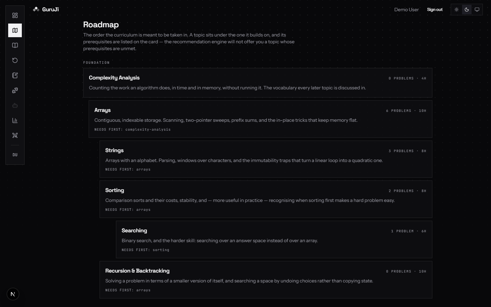</td>
    <td width="50%">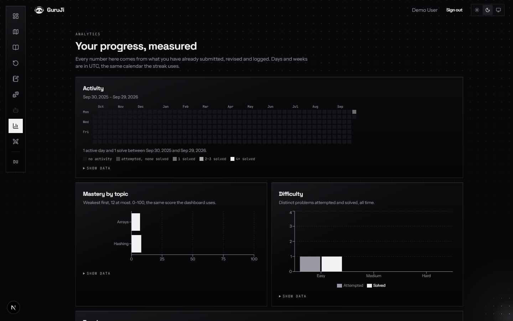</td>
  </tr>
  <tr>
    <td><b>Roadmap.</b> Topics in curriculum order. The engine never offers a topic whose prerequisites are unmet.</td>
    <td><b>Analytics.</b> Activity, mastery per topic and difficulty spread. Every number comes from real submissions.</td>
  </tr>
  <tr>
    <td width="50%">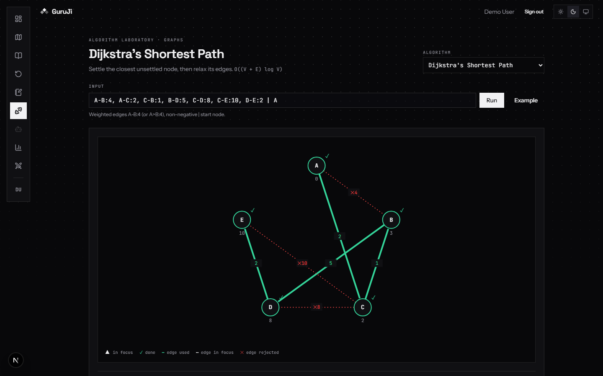</td>
    <td width="50%">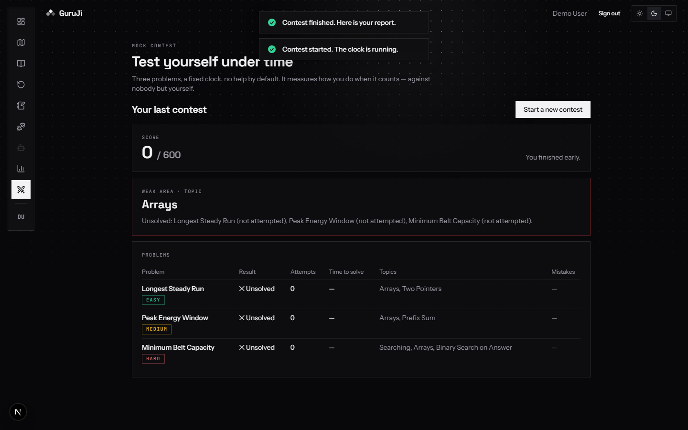</td>
  </tr>
  <tr>
    <td><b>Visualizer.</b> Step through arrays, linked lists, trees, graphs and DP with your own input.</td>
    <td><b>Mock contest.</b> Three problems, fixed clock, no help by default. The report names your weak area.</td>
  </tr>
</table>

<details>
<summary><b>More screenshots</b> — badges, login, mobile, mentor flow</summary>
<br>

| | |
|---|---|
| 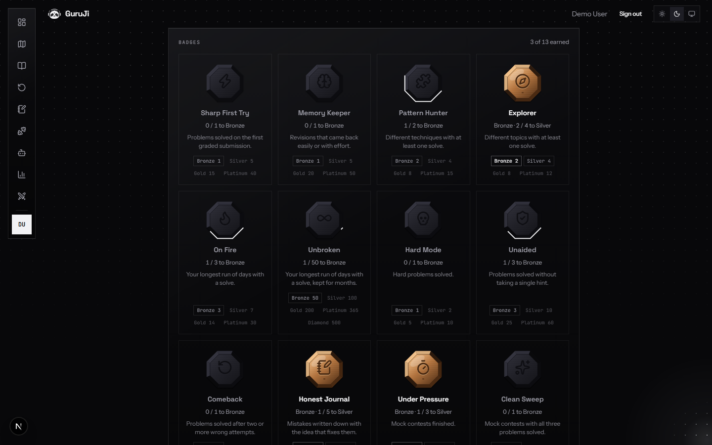 | 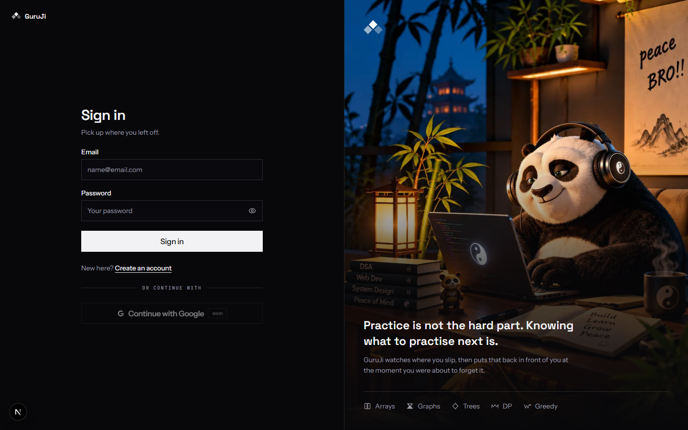 |
| Badges. Fun, but never fed into mastery. | Login |
| 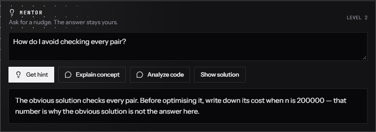 | 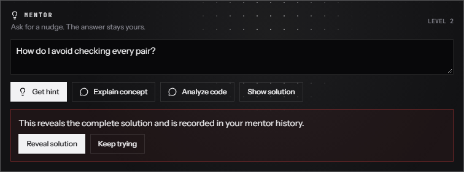 |
| A level-1 hint | The solution asks first |
| 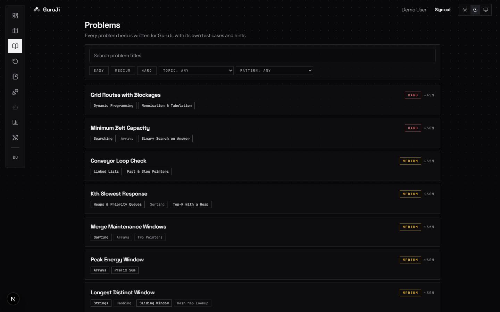 | 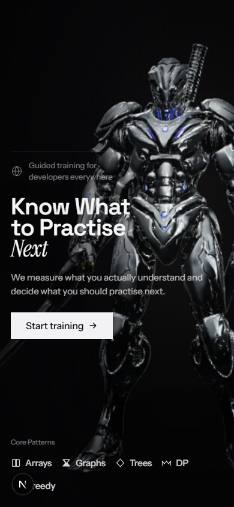 |
| Problem list | Landing on mobile |

</details>

---

## How it works

### Architecture

Three apps, shared packages, one trust boundary that matters: **user code never
runs in the API process.**

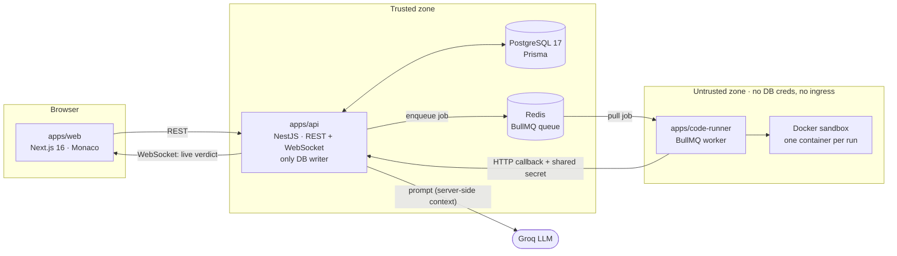
```mermaid
flowchart LR
    subgraph Browser
        W["apps/web<br/>Next.js 16 · Monaco"]
    end

    subgraph Server["Trusted zone"]
        API["apps/api<br/>NestJS · REST + WebSocket<br/>only DB writer"]
        PG[("PostgreSQL 17<br/>Prisma")]
        R[("Redis<br/>BullMQ queue")]
    end

    subgraph Untrusted["Untrusted zone · no DB creds, no ingress"]
        RUN["apps/code-runner<br/>BullMQ worker"]
        SB["Docker sandbox<br/>one container per run"]
    end

    GROQ(["Groq LLM"])

    W -- "REST" --> API
    API -- "WebSocket: live verdict" --> W
    API <--> PG
    API -- "enqueue job" --> R
    R -- "pull job" --> RUN
    RUN --> SB
    RUN -- "HTTP callback + shared secret" --> API
    API -- "prompt (server-side context)" --> GROQ
```

| Package | Role |
|---|---|
| `packages/types` | Zod schemas shared by web, api and runner. One definition, never two. |
| `packages/database` | Prisma schema, client, migrations, seed. |
| `packages/ai` | `LLMProvider` seam, layered prompts, response schemas. |
| `packages/algorithms` | Step-event generators for the visualizer. |
| `packages/ui` | Shared components and design tokens. |
| `packages/config` | Shared tsconfig / eslint / prettier presets. |

### Life of a submission

The critical path. Everything after the verdict happens in **one database
transaction**: a submission that updates mastery but fails to schedule revision
would quietly corrupt the learning model.

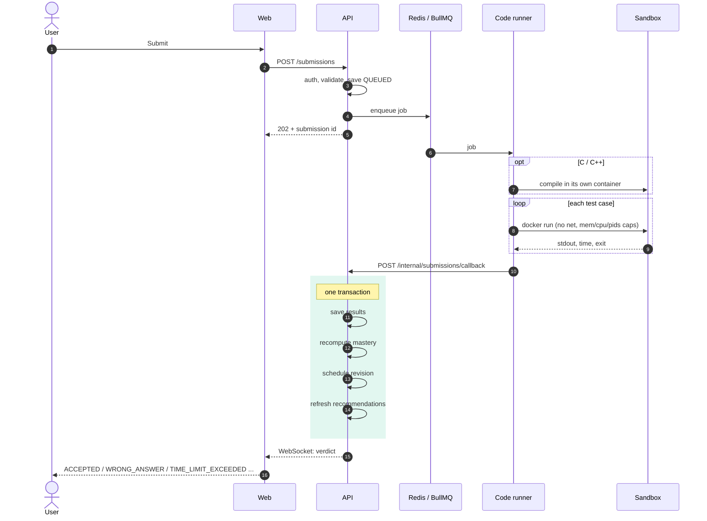
```mermaid
sequenceDiagram
    autonumber
    actor U as User
    participant W as Web
    participant A as API
    participant Q as Redis / BullMQ
    participant R as Code runner
    participant S as Sandbox

    U->>W: Submit
    W->>A: POST /submissions
    A->>A: auth, validate, save QUEUED
    A->>Q: enqueue job
    A-->>W: 202 + submission id
    Q->>R: job
    opt C / C++
        R->>S: compile in its own container
    end
    loop each test case
        R->>S: docker run (no net, mem/cpu/pids caps)
        S-->>R: stdout, time, exit
    end
    R->>A: POST /internal/submissions/callback
    rect rgba(16,185,129,0.12)
        Note over A: one transaction
        A->>A: save results
        A->>A: recompute mastery
        A->>A: schedule revision
        A->>A: refresh recommendations
    end
    A-->>W: WebSocket: verdict
    W-->>U: ACCEPTED / WRONG_ANSWER / TIME_LIMIT_EXCEEDED ...
```

Verdicts: `ACCEPTED` · `WRONG_ANSWER` · `TIME_LIMIT_EXCEEDED` ·
`MEMORY_LIMIT_EXCEEDED` · `RUNTIME_ERROR` · `COMPILE_ERROR`.

### The mastery model

Mastery is **never** `solved / total`. It answers a harder question: *given a new
problem in this topic tomorrow, could you solve it unaided, correctly, in
reasonable time?*

```
mastery = 100 × clamp01(
      0.30 × accuracy
    + 0.20 × retention
    + 0.20 × difficultyPerformance
    + 0.15 × patternCoverage
    + 0.15 × speed
    − 0.20 × hintDependency
) × confidence
```

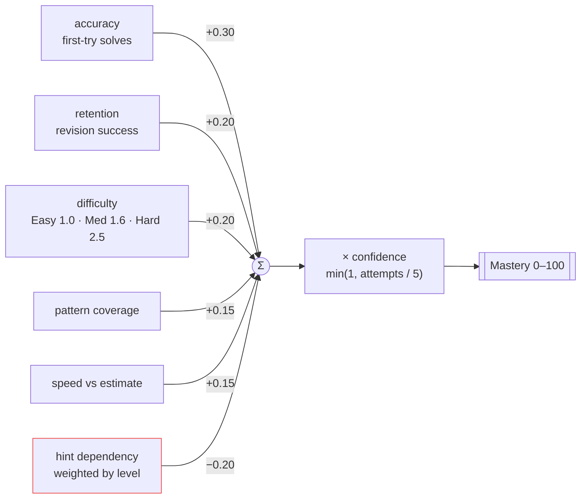
```mermaid
flowchart LR
    ACC["accuracy<br/>first-try solves"] -->|+0.30| SUM
    RET["retention<br/>revision success"] -->|+0.20| SUM
    DIF["difficulty<br/>Easy 1.0 · Med 1.6 · Hard 2.5"] -->|+0.20| SUM
    PAT["pattern coverage"] -->|+0.15| SUM
    SPD["speed vs estimate"] -->|+0.15| SUM
    HINT["hint dependency<br/>weighted by level"] -->|−0.20| SUM
    SUM(("Σ")) --> CONF["× confidence<br/>min(1, attempts / 5)"]
    CONF --> M[["Mastery 0–100"]]

    style HINT stroke:#ef4444
```

- **Confidence** stops one lucky solve from reading as 100%. A score only
  approaches its real value after about five attempts.
- **Hints subtract** rather than being ignored. Heavy hint use is evidence of a
  gap, not just missing evidence.
- Weights live in [`mastery-weights.ts`](apps/api/src/mastery/mastery-weights.ts),
  one object, so every tuning change shows up in a diff.

### The revision engine

Spaced repetition adapted for problem solving. The base ladder is
`1 → 3 → 7 → 14 → 30 → 60 → 120` days, stretched or shrunk by a per-problem ease
factor (2.5 default, clamped to 1.3–3.0).

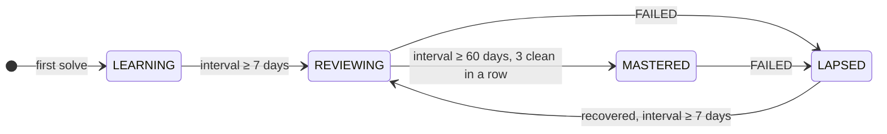
```mermaid
stateDiagram-v2
    direction LR
    [*] --> LEARNING: first solve
    LEARNING --> REVIEWING: interval ≥ 7 days
    REVIEWING --> MASTERED: interval ≥ 60 days, 3 clean in a row
    REVIEWING --> LAPSED: FAILED
    MASTERED --> LAPSED: FAILED
    LAPSED --> REVIEWING: recovered, interval ≥ 7 days
```

| Outcome | Ease | Next interval |
|---|---|---|
| `SOLVED_EASILY` | +0.15 | advance the ladder |
| `SOLVED_WITH_EFFORT` | unchanged | advance the ladder |
| `STRUGGLED` | −0.15 | halve it, stay on the rung (min 1 day) |
| `FAILED` | −0.20 | back to 1 day, `lapses + 1` |

A `LAPSED` item jumps the queue: knowledge you had and lost is the cheapest to
win back.

### The recommendation engine

The brain behind **Train Now**. Four separate stages, each with its own tests.

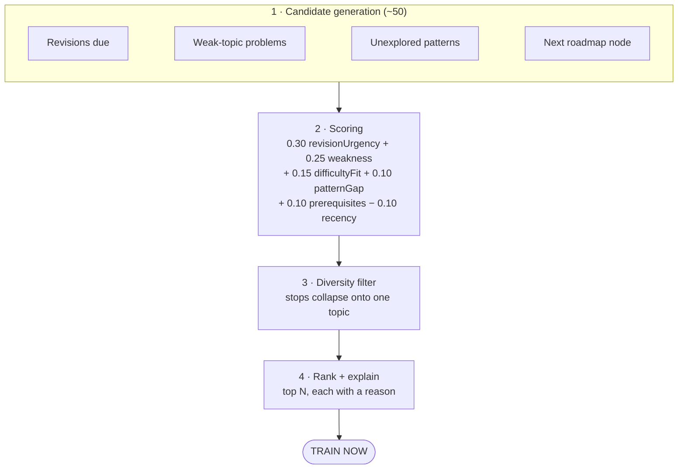
```mermaid
flowchart TB
    subgraph G["1 · Candidate generation (~50)"]
        direction LR
        P1[Revisions due] ~~~ P2[Weak-topic problems] ~~~ P3[Unexplored patterns] ~~~ P4[Next roadmap node]
    end
    G --> S["2 · Scoring<br/>0.30 revisionUrgency + 0.25 weakness<br/>+ 0.15 difficultyFit + 0.10 patternGap<br/>+ 0.10 prerequisites − 0.10 recency"]
    S --> D["3 · Diversity filter<br/>stops collapse onto one topic"]
    D --> X["4 · Rank + explain<br/>top N, each with a reason"]
    X --> T(["TRAIN NOW"])
```

- **Prerequisites are a hard gate.** No graphs before you can do arrays.
- **Weakness is relative** to your own average, not an absolute bar.
- **Difficulty fit peaks just above** your current level, the useful stretch.

### The AI mentor

The mentor is there to teach, not to solve. Problem context is loaded on the
server from the database. The client sends only a problem id, so nobody can
rewrite the problem to coax out an answer.

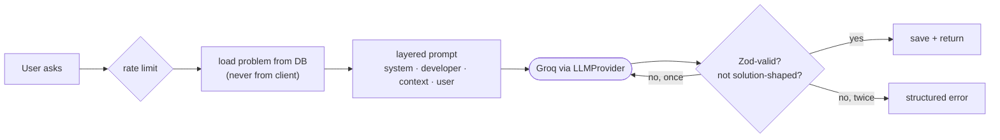
```mermaid
flowchart LR
    Q["User asks"] --> RL{"rate limit"}
    RL --> CTX["load problem from DB<br/>(never from client)"]
    CTX --> PR["layered prompt<br/>system · developer · context · user"]
    PR --> LLM(["Groq via LLMProvider"])
    LLM --> V{"Zod-valid?<br/>not solution-shaped?"}
    V -- yes --> OUT["save + return"]
    V -- "no, once" --> LLM
    V -- "no, twice" --> ERR["structured error"]
```

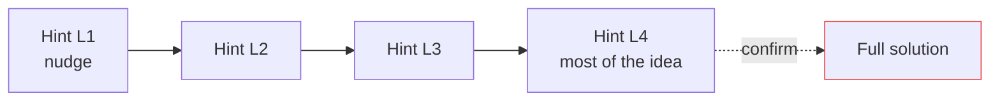
```mermaid
flowchart LR
    H1["Hint L1<br/>nudge"] --> H2["Hint L2"] --> H3["Hint L3"] --> H4["Hint L4<br/>most of the idea"] -.confirm.-> SOL["Full solution"]
    style SOL stroke:#ef4444
```

Each step down the ladder weighs more in `hintDependency` (0 · 0.25 · 0.5 ·
0.75 · 1.0). Asking for a nudge is cheap. Being walked to the answer is not.

### The sandbox

Untrusted code runs here by design, so this is the largest attack surface in the
system. Every flag maps to one specific defence.

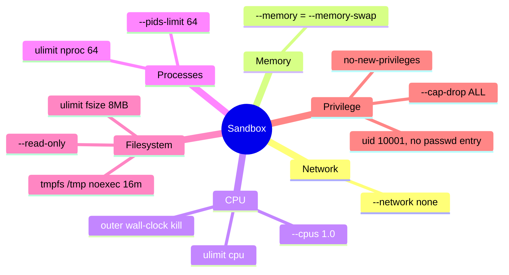
```mermaid
mindmap
  root((Sandbox))
    Network
      --network none
    Memory
      --memory = --memory-swap
    CPU
      --cpus 1.0
      ulimit cpu
      outer wall-clock kill
    Processes
      --pids-limit 64
      ulimit nproc 64
    Filesystem
      --read-only
      tmpfs /tmp noexec 16m
      ulimit fsize 8MB
    Privilege
      --cap-drop ALL
      no-new-privileges
      uid 10001, no passwd entry
```

The timeout is enforced twice: the kernel kills CPU-burning code from inside,
and the runner kills the container from outside for code that just sleeps.
Full threat model: [docs/code-execution.md](docs/code-execution.md).

---

## Repository layout

```
apps/api           NestJS · REST + one WebSocket namespace · the only DB writer
apps/code-runner   BullMQ worker · runs user code in Docker sandboxes
apps/web           Next.js App Router · Monaco editor
packages/types     Zod schemas shared by all three
packages/database  Prisma schema, client, migrations, seed
packages/ai        LLM provider seam, prompts, response schemas
packages/algorithms  Visualizer step-event generators
docker/sandbox     One image per language: c, cpp, python, javascript
docs/              Design docs — start at docs/README.md
```

---

## Local setup

**Prerequisites:** Node ≥ 22, pnpm ≥ 10, Docker Desktop **running**.

```bash
git clone https://github.com/sagarjain03/GuruJi.git
cd GuruJi
pnpm install
cp .env.example .env                              # fill in the values
pnpm infra:up                                     # Postgres + Redis
pnpm db:migrate
pnpm db:seed
pnpm --filter @guruji/code-runner images:build    # sandbox images, one per language
pnpm dev                                          # web on :3000, api on :4000
```

More commands and the rules for contributing: [docs/contributing.md](docs/contributing.md).

---

## Deploying for free

Only `apps/web` can run on Vercel. The API needs a long-running process for its
WebSocket, and the code runner needs a Docker daemon, which Vercel does not
provide. Those two, plus Postgres and Redis, run on one free VM.

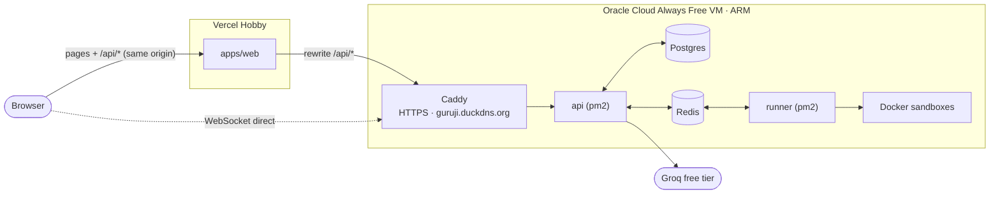
```mermaid
flowchart LR
    U(["Browser"])

    subgraph V["Vercel Hobby"]
        WEB["apps/web"]
    end

    subgraph O["Oracle Cloud Always Free VM · ARM"]
        CAD["Caddy<br/>HTTPS · guruji.duckdns.org"]
        API["api (pm2)"]
        RUN["runner (pm2)"]
        PG[("Postgres")]
        RD[("Redis")]
        DK["Docker sandboxes"]
        CAD --> API
        API <--> PG
        API <--> RD
        RD <--> RUN
        RUN --> DK
    end

    GQ(["Groq free tier"])

    U -- "pages + /api/* (same origin)" --> WEB
    WEB -- "rewrite /api/*" --> CAD
    U -.->|WebSocket direct| CAD
    API --> GQ
```

| Part | Where | Cost |
|---|---|---|
| `apps/web` | Vercel Hobby | Free, non-commercial use only |
| API, runner, Postgres, Redis | Oracle Cloud Always Free VM (ARM) | Free, card verification at signup |
| HTTPS hostname | DuckDNS subdomain + Caddy | Free |
| AI | Groq free tier | Free, rate-limited |

Free-tier limits change. Check each provider's pricing page before you sign up.

> **Status:** step 7 below (the Vercel rewrite and `NEXT_PUBLIC_WS_URL`) is not
> in the code yet. Until it lands, the free setup cannot keep users logged in.

<details>
<summary><b>Step-by-step deployment guide</b></summary>

### 1. Create the VM

- Oracle Cloud → **Compute → Create Instance**
- Image **Ubuntu 24.04**, shape **VM.Standard.A1.Flex**, 2–4 OCPU, 12–24 GB RAM
- In the VCN's Security List, open ports **80** and **443**

Oracle's Ubuntu image also runs its own iptables firewall. Open the ports there too:

```bash
sudo iptables -I INPUT 6 -p tcp --dport 80 -j ACCEPT
sudo iptables -I INPUT 6 -p tcp --dport 443 -j ACCEPT
sudo netfilter-persistent save
```

### 2. Point a hostname at it

On [duckdns.org](https://www.duckdns.org), claim a subdomain (for example
`guruji.duckdns.org`) and set it to the VM's public IP.

### 3. Install the tools

```bash
curl -fsSL https://get.docker.com | sh
sudo usermod -aG docker $USER                 # log out and back in
curl -fsSL https://deb.nodesource.com/setup_22.x | sudo -E bash -
sudo apt install -y nodejs caddy
sudo npm i -g pnpm@10 pm2
```

### 4. Configure

```bash
git clone https://github.com/sagarjain03/GuruJi.git && cd GuruJi
cp .env.example .env
```

Change at least these values in `.env`:

```
NODE_ENV=production
POSTGRES_PASSWORD=<strong password — use the same one in DATABASE_URL>
JWT_ACCESS_SECRET=<openssl rand -base64 48>
JWT_REFRESH_SECRET=<a different one>
CODE_RUNNER_SHARED_SECRET=<a different one>
CORS_ORIGINS=https://<your-project>.vercel.app
GROQ_API_KEY=<your key>
```

Do not leave any secret at its `.env.example` value, and never commit `.env`.
`NODE_ENV=production` is required: it is what marks the refresh cookie `Secure`.

### 5. Build, migrate, start

```bash
pnpm install
pnpm infra:up
pnpm --filter @guruji/database exec prisma migrate deploy
pnpm db:seed
pnpm build
pnpm --filter @guruji/code-runner images:build   # built on the VM, so arm64

pm2 start "pnpm --filter @guruji/api start" --name api
pm2 start "pnpm --filter @guruji/code-runner start" --name runner
pm2 save && pm2 startup
```

Use `prisma migrate deploy` here, not `pnpm db:migrate`. The latter runs
`prisma migrate dev`, which is for development only.

### 6. HTTPS with Caddy

`/etc/caddy/Caddyfile`:

```
guruji.duckdns.org {
    reverse_proxy localhost:4000
}
```

```bash
sudo systemctl reload caddy
```

Caddy gets the certificate itself and passes WebSocket upgrades through.
`https://guruji.duckdns.org/api/health` should now respond.

### 7. Why the web app proxies the API

The refresh token is an `httpOnly` cookie with `SameSite=Strict`.
`*.vercel.app` and `*.duckdns.org` are different sites, so the browser would
never send that cookie to the API, and users would be logged out when the
15-minute access token expires.

The fix is to keep REST on the web app's own origin:

- `apps/web/vercel.json` rewrites `/api/*` to `https://guruji.duckdns.org/api/*`,
  so the browser only ever talks to the Vercel origin and the cookie is first-party.
- The WebSocket connects straight to the VM through `NEXT_PUBLIC_WS_URL`.
  Rewrites do not carry WebSockets, and the socket does not need the cookie:
  it authenticates with the access token in its handshake.

If you own a domain, you do not need this step. Put the web app on
`app.example.com` and the API on `api.example.com`. They are the same site, so
the strict cookie works as-is.

### 8. Deploy the web app on Vercel

**Add New → Project**, import the repository, then:

| Setting | Value |
|---|---|
| Root Directory | `apps/web` |
| Build Command | `cd ../.. && pnpm --filter "@guruji/web..." build` |
| Node.js Version | 22.x |

The build command builds `@guruji/types` and `@guruji/algorithms` first. Both
export from `dist/`, so the web build fails without them.

Environment variables:

```
NEXT_PUBLIC_API_URL=https://<your-project>.vercel.app/api
NEXT_PUBLIC_WS_URL=https://guruji.duckdns.org
NEXT_PUBLIC_SITE_URL=https://<your-project>.vercel.app
NEXT_PUBLIC_APP_NAME=GuruJi
```

`NEXT_PUBLIC_*` values are compiled into the bundle, and the Content Security
Policy is built from them. Redeploy after changing any of them. Never put
`GROQ_API_KEY` or any other secret in Vercel.

### 9. Check it works

- Sign up, log in, wait more than 15 minutes, then reload. You should still be logged in.
- Submit a solution. The verdict should arrive live.
- The browser console should show no CSP or CORS errors.

</details>

---

## Further reading

| Doc | What it covers |
|---|---|
| [architecture.md](docs/architecture.md) | How it fits together, and why |
| [mastery-model.md](docs/mastery-model.md) | How competence is measured |
| [revision-engine.md](docs/revision-engine.md) | How retention is scheduled |
| [recommendation-engine.md](docs/recommendation-engine.md) | How the next activity is chosen |
| [code-execution.md](docs/code-execution.md) | The sandbox and its threat model |
| [ai.md](docs/ai.md) | The mentor, and why it withholds answers |
| [security.md](docs/security.md) | Everything else security |
| [database.md](docs/database.md) · [erd.md](docs/erd.md) | Schema and why it is shaped that way |
| [api.md](docs/api.md) | Endpoints and conventions |
| [visualizer.md](docs/visualizer.md) | The algorithm event model |
| [roadmap.md](docs/roadmap.md) | What is built when |
