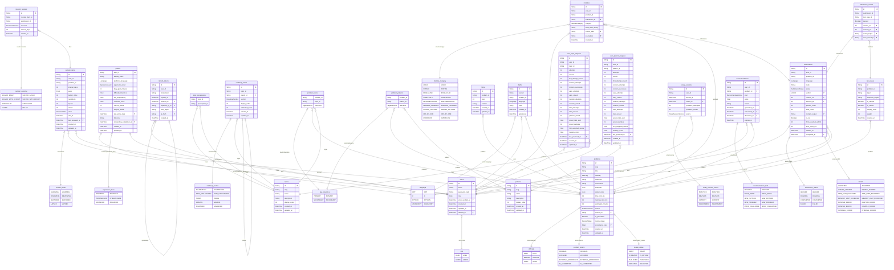

```mermaid
erDiagram

        role {
            USER USER
ADMIN ADMIN
        }
    


        language {
            CPP CPP
C C
PYTHON PYTHON
JAVASCRIPT JAVASCRIPT
        }
    


        experience_level {
            BEGINNER BEGINNER
INTERMEDIATE INTERMEDIATE
ADVANCED ADVANCED
        }
    


        difficulty {
            EASY EASY
MEDIUM MEDIUM
HARD HARD
        }
    


        problem_source {
            ORIGINAL ORIGINAL
LICENSED LICENSED
EXTERNAL_REFERENCE EXTERNAL_REFERENCE
AI_GENERATED AI_GENERATED
        }
    


        review_status {
            DRAFT DRAFT
IN_REVIEW IN_REVIEW
PUBLISHED PUBLISHED
REJECTED REJECTED
        }
    


        roadmap_section {
            FOUNDATION FOUNDATION
DATA_STRUCTURES DATA_STRUCTURES
TREES TREES
GRAPHS GRAPHS
ADVANCED ADVANCED
        }
    


        tag_relevance {
            PRIMARY PRIMARY
SECONDARY SECONDARY
        }
    


        submission_status {
            QUEUED QUEUED
RUNNING RUNNING
COMPLETED COMPLETED
FAILED FAILED
        }
    


        verdict {
            ACCEPTED ACCEPTED
WRONG_ANSWER WRONG_ANSWER
TIME_LIMIT_EXCEEDED TIME_LIMIT_EXCEEDED
MEMORY_LIMIT_EXCEEDED MEMORY_LIMIT_EXCEEDED
RUNTIME_ERROR RUNTIME_ERROR
COMPILE_ERROR COMPILE_ERROR
INTERNAL_ERROR INTERNAL_ERROR
        }
    


        mistake_category {
            LOGIC LOGIC
SYNTAX SYNTAX
EDGE_CASE EDGE_CASE
COMPLEXITY COMPLEXITY
IMPLEMENTATION IMPLEMENTATION
MISREAD_PROBLEM MISREAD_PROBLEM
WRONG_PATTERN WRONG_PATTERN
OFF_BY_ONE OFF_BY_ONE
OVERFLOW OVERFLOW
        }
    


        study_session_source {
            PRACTICE PRACTICE
REVISION REVISION
CONTEST CONTEST
ASSESSMENT ASSESSMENT
        }
    


        revision_outcome {
            SOLVED_EASILY SOLVED_EASILY
SOLVED_WITH_EFFORT SOLVED_WITH_EFFORT
STRUGGLED STRUGGLED
FAILED FAILED
        }
    


        revision_state {
            LEARNING LEARNING
REVIEWING REVIEWING
MASTERED MASTERED
LAPSED LAPSED
        }
    


        recommendation_kind {
            REVISION REVISION
WEAK_TOPIC WEAK_TOPIC
NEW_PATTERN NEW_PATTERN
NEW_PROBLEM NEW_PROBLEM
MOCK_CHALLENGE MOCK_CHALLENGE
        }
    
  "users" {
    String id "🗝️"
    String email 
    String password_hash 
    Role role 
    DateTime email_verified_at "❓"
    DateTime created_at 
    DateTime updated_at 
    DateTime deleted_at "❓"
    }
  

  "profiles" {
    String user_id "🗝️"
    String display_name 
    Language preferred_language 
    ExperienceLevel experience_level 
    Int daily_goal_minutes 
    Float difficulty_tolerance 
    Float hint_dependency 
    Float retention_score 
    Int current_streak 
    Int longest_streak 
    DateTime last_active_date "❓"
    String timezone 
    DateTime onboarding_completed_at "❓"
    DateTime created_at 
    DateTime updated_at 
    }
  

  "refresh_tokens" {
    String id "🗝️"
    String user_id 
    String token_hash 
    DateTime expires_at 
    DateTime revoked_at "❓"
    String replaced_by_id "❓"
    String user_agent "❓"
    String ip_hash "❓"
    DateTime created_at 
    }
  

  "topics" {
    String id "🗝️"
    String slug 
    String name 
    String description 
    Int display_order 
    DateTime created_at 
    DateTime updated_at 
    }
  

  "topic_prerequisites" {
    String topic_id 
    String prerequisite_id 
    }
  

  "patterns" {
    String id "🗝️"
    String slug 
    String name 
    String description 
    Int display_order 
    DateTime created_at 
    DateTime updated_at 
    }
  

  "roadmap_nodes" {
    String id "🗝️"
    String topic_id 
    String parent_id "❓"
    RoadmapSection section 
    Int display_order 
    Int estimated_hours 
    DateTime created_at 
    DateTime updated_at 
    }
  

  "problems" {
    String id "🗝️"
    String slug 
    String title 
    Difficulty difficulty 
    String statement 
    String constraints 
    Json examples 
    Json starter_code 
    Int time_limit_ms 
    Int memory_limit_mb 
    Int estimated_minutes 
    ProblemSource source 
    String source_url "❓"
    Boolean ai_generated 
    ReviewStatus review_status 
    Float acceptance_rate "❓"
    DateTime created_at 
    DateTime updated_at 
    }
  

  "problem_topics" {
    String problem_id 
    String topic_id 
    TagRelevance relevance 
    }
  

  "problem_patterns" {
    String problem_id 
    String pattern_id 
    TagRelevance relevance 
    }
  

  "test_cases" {
    String id "🗝️"
    String problem_id 
    String input 
    String expected_output 
    Boolean is_sample 
    Boolean is_hidden 
    Int display_order 
    Int weight 
    DateTime created_at 
    }
  

  "hints" {
    String id "🗝️"
    String problem_id 
    Int level 
    String content 
    DateTime created_at 
    DateTime updated_at 
    }
  

  "drafts" {
    String id "🗝️"
    String user_id 
    String problem_id 
    Language language 
    String code 
    DateTime created_at 
    DateTime updated_at 
    }
  

  "submissions" {
    String id "🗝️"
    String user_id 
    String problem_id 
    Language language 
    String code 
    SubmissionStatus status 
    Verdict verdict "❓"
    Int runtime_ms "❓"
    Int memory_kb "❓"
    Int passed_count 
    Int total_count 
    String compile_output "❓"
    Boolean is_run 
    Int hints_used_at_submit 
    Int time_spent_ms 
    DateTime created_at 
    DateTime completed_at "❓"
    }
  

  "submission_results" {
    String id "🗝️"
    String submission_id 
    String test_case_id 
    Boolean passed 
    Int runtime_ms "❓"
    Int memory_kb "❓"
    String actual_output "❓"
    String error_message "❓"
    }
  

  "user_topic_progress" {
    String id "🗝️"
    String user_id 
    String topic_id 
    Int attempts 
    Int solved 
    Int first_attempt_solved 
    Int revision_attempts 
    Int revision_successes 
    Int easy_attempts 
    Int easy_solved 
    Int medium_attempts 
    Int medium_solved 
    Int hard_attempts 
    Int hard_solved 
    Int patterns_solved 
    Float speed_ratio_sum 
    Int speed_samples 
    Float hint_weighted_solves 
    Float mastery_score 
    DateTime last_practiced_at "❓"
    DateTime created_at 
    DateTime updated_at 
    }
  

  "user_pattern_progress" {
    String id "🗝️"
    String user_id 
    String pattern_id 
    Int attempts 
    Int solved 
    Int first_attempt_solved 
    Int revision_attempts 
    Int revision_successes 
    Int easy_attempts 
    Int easy_solved 
    Int medium_attempts 
    Int medium_solved 
    Int hard_attempts 
    Int hard_solved 
    Float speed_ratio_sum 
    Int speed_samples 
    Float hint_weighted_solves 
    Float mastery_score 
    DateTime last_practiced_at "❓"
    DateTime created_at 
    DateTime updated_at 
    }
  

  "mistakes" {
    String id "🗝️"
    String user_id 
    String problem_id 
    String submission_id "❓"
    MistakeCategory category 
    String what_went_wrong 
    String correct_idea "❓"
    String ai_analysis "❓"
    DateTime created_at 
    }
  

  "study_sessions" {
    String id "🗝️"
    String user_id 
    DateTime started_at 
    DateTime ended_at "❓"
    Int problems_attempted 
    Int problems_solved 
    StudySessionSource source 
    }
  

  "revision_items" {
    String id "🗝️"
    String user_id 
    String problem_id 
    Int interval_days 
    Float ease 
    Int ladder_index 
    Int repetitions 
    Int lapses 
    Int streak 
    RevisionState state 
    DateTime due_at 
    DateTime last_reviewed_at "❓"
    DateTime created_at 
    DateTime updated_at 
    }
  

  "revision_reviews" {
    String id "🗝️"
    String revision_item_id 
    String submission_id "❓"
    RevisionOutcome outcome 
    Int interval_days 
    DateTime created_at 
    }
  

  "recommendations" {
    String id "🗝️"
    String user_id 
    String problem_id "❓"
    RecommendationKind kind 
    Float score 
    String reason 
    DateTime generated_at 
    DateTime consumed_at "❓"
    DateTime dismissed_at "❓"
    DateTime expires_at 
    }
  
    "users" |o--|| "role" : "enum:role"
    "profiles" |o--|| "language" : "enum:preferred_language"
    "profiles" |o--|| "experience_level" : "enum:experience_level"
    "profiles" |o--|| "users" : "user"
    "refresh_tokens" }o--|| "users" : "user"
    "refresh_tokens" |o--|o "refresh_tokens" : "replacedBy"
    "topic_prerequisites" }o--|| "topics" : "topic"
    "topic_prerequisites" }o--|| "topics" : "prerequisite"
    "roadmap_nodes" |o--|| "roadmap_section" : "enum:section"
    "roadmap_nodes" }o--|| "topics" : "topic"
    "roadmap_nodes" |o--|o "roadmap_nodes" : "parent"
    "problems" |o--|| "difficulty" : "enum:difficulty"
    "problems" |o--|| "problem_source" : "enum:source"
    "problems" |o--|| "review_status" : "enum:review_status"
    "problem_topics" |o--|| "tag_relevance" : "enum:relevance"
    "problem_topics" }o--|| "problems" : "problem"
    "problem_topics" }o--|| "topics" : "topic"
    "problem_patterns" |o--|| "tag_relevance" : "enum:relevance"
    "problem_patterns" }o--|| "problems" : "problem"
    "problem_patterns" }o--|| "patterns" : "pattern"
    "test_cases" }o--|| "problems" : "problem"
    "hints" }o--|| "problems" : "problem"
    "drafts" |o--|| "language" : "enum:language"
    "drafts" }o--|| "users" : "user"
    "drafts" }o--|| "problems" : "problem"
    "submissions" |o--|| "language" : "enum:language"
    "submissions" |o--|| "submission_status" : "enum:status"
    "submissions" |o--|o "verdict" : "enum:verdict"
    "submissions" }o--|| "users" : "user"
    "submissions" }o--|| "problems" : "problem"
    "submission_results" }o--|| "submissions" : "submission"
    "submission_results" }o--|| "test_cases" : "testCase"
    "user_topic_progress" }o--|| "users" : "user"
    "user_topic_progress" }o--|| "topics" : "topic"
    "user_pattern_progress" }o--|| "users" : "user"
    "user_pattern_progress" }o--|| "patterns" : "pattern"
    "mistakes" |o--|| "mistake_category" : "enum:category"
    "mistakes" }o--|| "users" : "user"
    "mistakes" }o--|| "problems" : "problem"
    "mistakes" }o--|o "submissions" : "submission"
    "study_sessions" |o--|| "study_session_source" : "enum:source"
    "study_sessions" }o--|| "users" : "user"
    "revision_items" |o--|| "revision_state" : "enum:state"
    "revision_items" }o--|| "users" : "user"
    "revision_items" }o--|| "problems" : "problem"
    "revision_reviews" |o--|| "revision_outcome" : "enum:outcome"
    "revision_reviews" }o--|| "revision_items" : "item"
    "recommendations" |o--|| "recommendation_kind" : "enum:kind"
    "recommendations" }o--|| "users" : "user"
    "recommendations" }o--|o "problems" : "problem"
```
