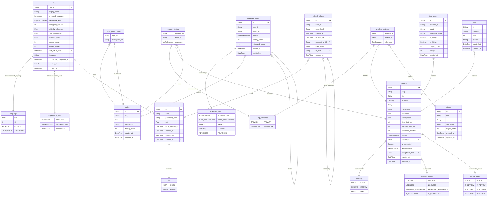

```mermaid
erDiagram

        role {
            USER USER
ADMIN ADMIN
        }


        language {
            CPP CPP
C C
PYTHON PYTHON
JAVASCRIPT JAVASCRIPT
        }


        experience_level {
            BEGINNER BEGINNER
INTERMEDIATE INTERMEDIATE
ADVANCED ADVANCED
        }


        difficulty {
            EASY EASY
MEDIUM MEDIUM
HARD HARD
        }


        problem_source {
            ORIGINAL ORIGINAL
LICENSED LICENSED
EXTERNAL_REFERENCE EXTERNAL_REFERENCE
AI_GENERATED AI_GENERATED
        }


        review_status {
            DRAFT DRAFT
IN_REVIEW IN_REVIEW
PUBLISHED PUBLISHED
REJECTED REJECTED
        }


        roadmap_section {
            FOUNDATION FOUNDATION
DATA_STRUCTURES DATA_STRUCTURES
TREES TREES
GRAPHS GRAPHS
ADVANCED ADVANCED
        }


        tag_relevance {
            PRIMARY PRIMARY
SECONDARY SECONDARY
        }

  "users" {
    String id "🗝️"
    String email
    String password_hash
    Role role
    DateTime email_verified_at "❓"
    DateTime created_at
    DateTime updated_at
    DateTime deleted_at "❓"
    }


  "profiles" {
    String user_id "🗝️"
    String display_name
    Language preferred_language
    ExperienceLevel experience_level
    Int daily_goal_minutes
    Float difficulty_tolerance
    Float hint_dependency
    Float retention_score
    Int current_streak
    Int longest_streak
    DateTime last_active_date "❓"
    String timezone
    DateTime onboarding_completed_at "❓"
    DateTime created_at
    DateTime updated_at
    }


  "refresh_tokens" {
    String id "🗝️"
    String user_id
    String token_hash
    DateTime expires_at
    DateTime revoked_at "❓"
    String replaced_by_id "❓"
    String user_agent "❓"
    String ip_hash "❓"
    DateTime created_at
    }


  "topics" {
    String id "🗝️"
    String slug
    String name
    String description
    Int display_order
    DateTime created_at
    DateTime updated_at
    }


  "topic_prerequisites" {
    String topic_id
    String prerequisite_id
    }


  "patterns" {
    String id "🗝️"
    String slug
    String name
    String description
    Int display_order
    DateTime created_at
    DateTime updated_at
    }


  "roadmap_nodes" {
    String id "🗝️"
    String topic_id
    String parent_id "❓"
    RoadmapSection section
    Int display_order
    Int estimated_hours
    DateTime created_at
    DateTime updated_at
    }


  "problems" {
    String id "🗝️"
    String slug
    String title
    Difficulty difficulty
    String statement
    String constraints
    Json examples
    Json starter_code
    Int time_limit_ms
    Int memory_limit_mb
    Int estimated_minutes
    ProblemSource source
    String source_url "❓"
    Boolean ai_generated
    ReviewStatus review_status
    Float acceptance_rate "❓"
    DateTime created_at
    DateTime updated_at
    }


  "problem_topics" {
    String problem_id
    String topic_id
    TagRelevance relevance
    }


  "problem_patterns" {
    String problem_id
    String pattern_id
    TagRelevance relevance
    }


  "test_cases" {
    String id "🗝️"
    String problem_id
    String input
    String expected_output
    Boolean is_sample
    Boolean is_hidden
    Int display_order
    Int weight
    DateTime created_at
    }


  "hints" {
    String id "🗝️"
    String problem_id
    Int level
    String content
    DateTime created_at
    DateTime updated_at
    }

    "users" |o--|| "role" : "enum:role"
    "profiles" |o--|| "language" : "enum:preferred_language"
    "profiles" |o--|| "experience_level" : "enum:experience_level"
    "profiles" |o--|| "users" : "user"
    "refresh_tokens" }o--|| "users" : "user"
    "refresh_tokens" |o--|o "refresh_tokens" : "replacedBy"
    "topic_prerequisites" }o--|| "topics" : "topic"
    "topic_prerequisites" }o--|| "topics" : "prerequisite"
    "roadmap_nodes" |o--|| "roadmap_section" : "enum:section"
    "roadmap_nodes" }o--|| "topics" : "topic"
    "roadmap_nodes" |o--|o "roadmap_nodes" : "parent"
    "problems" |o--|| "difficulty" : "enum:difficulty"
    "problems" |o--|| "problem_source" : "enum:source"
    "problems" |o--|| "review_status" : "enum:review_status"
    "problem_topics" |o--|| "tag_relevance" : "enum:relevance"
    "problem_topics" }o--|| "problems" : "problem"
    "problem_topics" }o--|| "topics" : "topic"
    "problem_patterns" |o--|| "tag_relevance" : "enum:relevance"
    "problem_patterns" }o--|| "problems" : "problem"
    "problem_patterns" }o--|| "patterns" : "pattern"
    "test_cases" }o--|| "problems" : "problem"
    "hints" }o--|| "problems" : "problem"
```
