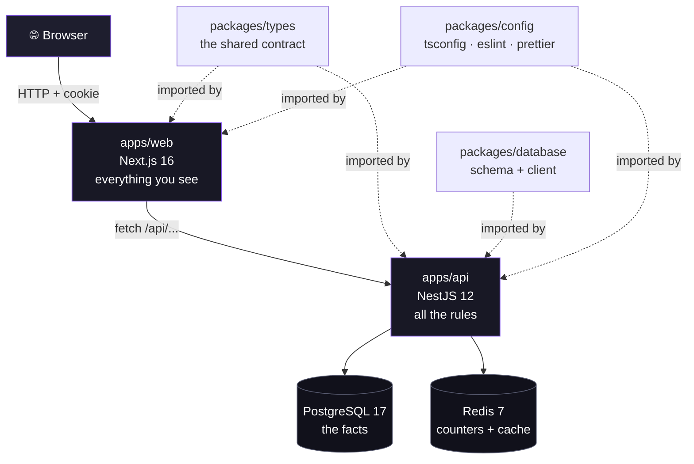
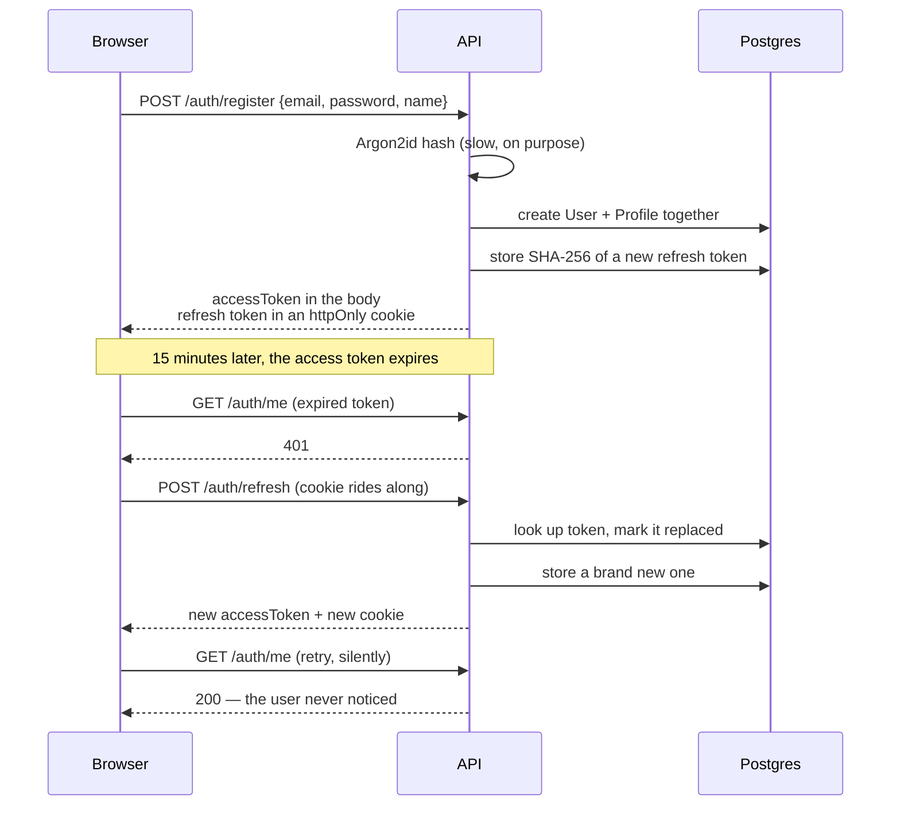
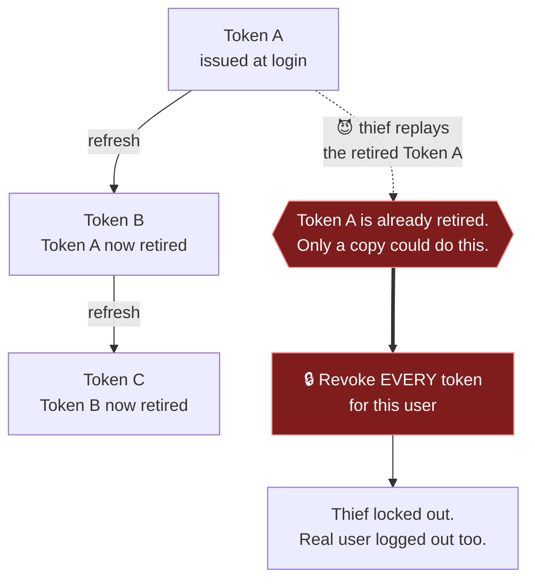
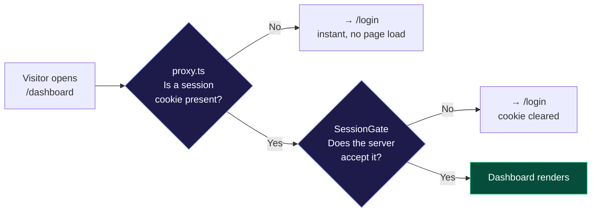
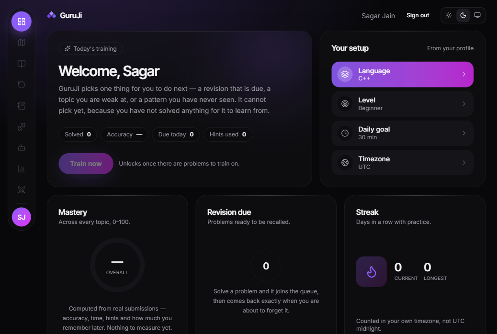
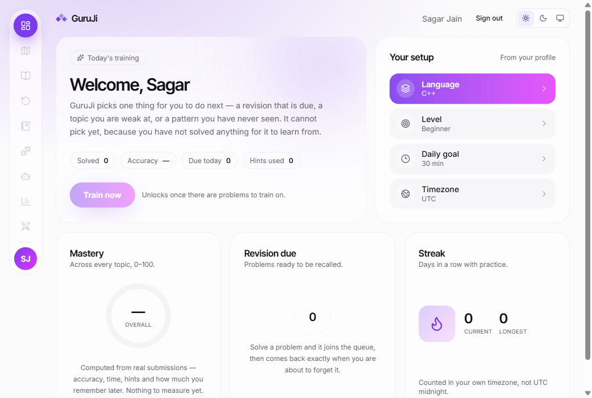

# Phase 1 — Foundation

> **Status:** done · 2026-09-19
> **One sentence:** you can now create an account, sign in, and land on a real
> dashboard — and everything behind that is wired up properly instead of faked.

This document explains what got built, in plain language, and why each decision
was made. If you read only one section, read [The five bugs we
hit](#the-five-bugs-we-hit) — that is where the real learning is.

---

## What you can actually do now

```
┌─────────────────────────────────────────────────────────────┐
│  1. Open the site          → landing page                   │
│  2. Click "Create account" → fill name, email, password     │
│  3. Submit                 → you are signed in              │
│  4. Land on the dashboard  → your real name, your settings  │
│  5. Refresh the page       → still signed in                │
│  6. Click "Sign out"       → back to login, session killed  │
│  7. Try /dashboard again   → bounced to login               │
└─────────────────────────────────────────────────────────────┘
```

That is the whole of Phase 1. It sounds small. The plumbing underneath it is
not, and every phase after this one sits on top of it.

---

## The shape of the thing

GuruJi is one repository holding several programs. They are separate on purpose:
the thing that runs your untrusted code (Phase 4) must never be the same process
as the thing holding your password.



Only `apps/api` talks to the database. The browser never does. That single rule
is what stops "just add a quick query in the frontend" from turning into a
security hole two phases from now.

---

## Step by step, what was built

### 1.1 — One set of rules for all the code

**The problem it solves.** Four programs in one repo means four chances to
disagree about tab width, about whether unused variables are an error, about
which TypeScript version. Multiply that by six months and you get a codebase
where every file looks like it was written by a different person.

**What we did.** `packages/config` holds one copy of the TypeScript settings, one
copy of the linting rules, one copy of the formatting rules. Every other package
points at it.

```
packages/config/
├── tsconfig/
│   ├── base.json     ← strict settings everyone inherits
│   ├── node.json     ← + decorators, for the API
│   └── next.json     ← + JSX and DOM, for the web app
├── eslint/
│   ├── base.js  node.js  next.js
└── prettier/index.js
```

Change a rule in one place, and the whole repo changes.

---

### 1.2 — The database and cache, running locally

Two containers: **PostgreSQL** (the permanent record) and **Redis** (fast,
temporary counters).

A useful analogy:

|                | Postgres                     | Redis                                 |
| -------------- | ---------------------------- | ------------------------------------- |
| Think of it as | a filing cabinet             | a sticky note on your monitor         |
| Holds          | users, problems, submissions | "this IP has tried to log in 4 times" |
| If it vanished | catastrophe                  | a minor inconvenience                 |
| Speed          | fast                         | absurdly fast                         |

Both are pinned to **UTC**. Not "mostly UTC" — the container, the connection,
and every timestamp column. Phase 6 schedules revisions by date arithmetic, and
a single timezone slip there means someone's streak breaks at midnight for
reasons nobody can reproduce.

---

### 1.3 — The database schema

Three tables. That is all Phase 1 needs.

```mermaid
erDiagram
    USERS ||--o| PROFILES : "has one"
    USERS ||--o{ REFRESH_TOKENS : "has many"

    USERS {
        uuid id PK
        varchar email UK "lowercase, unique"
        text password_hash "argon2id, never sent out"
        enum role "USER or ADMIN"
        timestamptz created_at
        timestamptz deleted_at "soft delete"
    }
    PROFILES {
        uuid user_id PK_FK
        varchar display_name
        enum preferred_language "CPP C PYTHON JAVASCRIPT"
        enum experience_level "BEGINNER INTERMEDIATE ADVANCED"
        int daily_goal_minutes
        int current_streak
        int longest_streak
        varchar timezone "IANA name, e.g. Asia/Kolkata"
    }
    REFRESH_TOKENS {
        uuid id PK
        uuid user_id FK
        text token_hash UK "SHA-256, never the token itself"
        timestamptz expires_at
        timestamptz revoked_at "null means live"
        uuid replaced_by_id "set when rotated"
    }
```

Three choices worth understanding:

**Why `User` and `Profile` are separate tables.** `User` is about _identity_ —
can you prove who you are. `Profile` is about _learning_ — what language you
write, how long your streak is, what timezone your day starts in. They change for
completely different reasons and get read by completely different code. Keeping
them apart means the login path never loads your streak, and the dashboard never
touches your password hash.

**Why UUIDs and not 1, 2, 3.** Your user id ends up in URLs. Sequential numbers
leak how many users exist and invite anyone to try `/user/1`, `/user/2`. We use
UUID version 7 — random enough to be unguessable, but with a timestamp at the
front so rows still land near each other on disk.

**Why timezone sits on the profile and not next to a timestamp.** Timestamps are
always UTC, full stop. But "did you practise today?" is a _local day_ question.
So the timezone is stored once, as a preference, and the answer is computed when
asked. Storing an offset like `+05:30` would break twice a year at daylight
saving.

---

### 1.4 — The API skeleton

The API is a series of gates. A request has to get through all of them:

```
   Request
      │
      ▼
 ┌──────────────┐  Helmet          → security headers
 │              │  CORS            → is this origin allowed?
 │  Every       │  cookie-parser   → read the session cookie
 │  request     │  pino logger     → stamp a request id on it
 │  passes      │  ValidationPipe  → does the body match the DTO?
 │  through     │                    unknown field → rejected
 │  here        │  Guard           → is there a valid token?
 └──────────────┘
      │
      ▼
  your handler
      │
      ├─ success → JSON
      └─ throw   → AllExceptionsFilter → one uniform error shape
```

**The error envelope.** Every single error, from any route, comes back looking
identical:

```json
{
  "error": {
    "code": "INVALID_CREDENTIALS",
    "message": "Email or password is incorrect.",
    "details": null,
    "requestId": "01925f3c-..."
  }
}
```

`code` is for the program (branch on it). `message` is for the human (show it).
`requestId` ties the response to the log line. When something breaks in
production, you ask the user for the request id and you have the whole story.

Internal errors never leak. If the database connection dies, the client gets
`"Something went wrong."` and nothing else — the stack trace goes to the log,
filed under that same request id.

**It refuses to boot on bad configuration.** Missing `DATABASE_URL`? The process
does not start. This is deliberate. A service that starts half-configured fails
later, in production, on a path nobody was watching.

```
$ LOG_LEVEL=shout node dist/main.js

Error: Invalid environment configuration:
  LOG_LEVEL: Invalid option: expected one of "fatal"|"error"|"warn"|"info"|"debug"|"trace"
```

---

### 1.5 — The shared contract

`packages/types` holds the shape of every request and response, written once.

```
                packages/types
                      │
        ┌─────────────┴─────────────┐
        ▼                           ▼
    apps/web                    apps/api
  form validation            request validation
```

The registration rules — email must be an email, password at least 12
characters, name between 1 and 80 — live in **one** file. The browser checks
them so you get instant feedback. The server checks them again because the
browser cannot be trusted. Same rules, one definition.

This is the alternative to the usual arrangement where the frontend and backend
each define their own version, and they drift until one day the server starts
rejecting something the form said was fine.

---

### 1.6 — Authentication

This is the biggest piece of Phase 1, and the one worth reading twice.

#### Passwords are never stored

```
  "my-secret-password"
          │
          ▼  Argon2id  (memory 19 MB, 2 passes)
          │
  "$argon2id$v=19$m=19456,t=2,p=1$k9Fm...$X7bQ..."
                                   ▲       ▲
                                   │       └── the hash
                                   └── random salt, different every time
```

Argon2id is _deliberately slow and memory-hungry_. A fast hash can be attacked
with a graphics card testing billions of guesses a second. Argon2id needs 19 MB
of memory per guess, which makes that hardware advantage mostly disappear.

The same password hashed twice gives two different results, because of the
random salt. So a stolen database does not reveal which users share a password.

#### Two tokens, two jobs

```
┌─ ACCESS TOKEN ──────────────────────┐   ┌─ REFRESH TOKEN ────────────────────┐
│  Lives: 15 minutes                  │   │  Lives: 30 days                    │
│  Where: in memory, in the tab       │   │  Where: httpOnly cookie            │
│  Sent:  on every API call           │   │  Sent:  only to /auth/refresh      │
│  If stolen: 15 minutes of damage    │   │  JavaScript cannot read it at all  │
└─────────────────────────────────────┘   └────────────────────────────────────┘
```

That split is the whole design. The token that travels constantly is nearly
worthless because it expires. The token that is valuable almost never travels,
and cannot be read by any script on the page — so a cross-site scripting bug
does not automatically hand over the account.

#### The dance, end to end



#### Rotation, and catching a thief

Every refresh **retires the old token and issues a new one**. That single rule
is what makes theft detectable.



Yes, the legitimate user gets logged out as well. That is the correct outcome:
someone has a copy of their session, and being asked to sign in again is a far
smaller cost than an attacker keeping access. There is a test for exactly this.

#### Two more defences

**The login answer is always the same.** Wrong password and no-such-account
return byte-for-byte identical responses. Otherwise the login form becomes a
tool for checking which email addresses have accounts here. We even run a dummy
password check when the account does not exist, so the _response time_ does not
give it away either.

**Five attempts per 15 minutes**, counted against the IP address _and_ against
the email. Counted in Redis, so the limit still holds when there are several API
servers — a counter kept in one process's memory would let N servers allow N
times the traffic.

---

### 1.7 — The web app

#### Two locks, not one



The first check is a **bouncer glancing at your wristband** — fast, and wrong
sometimes. It only knows a cookie exists, not whether the token inside it is
still good. The second check actually asks the server. The first exists purely so
a signed-out visitor is not made to download the whole dashboard before being
turned away.

#### Where the token lives

```
 Zustand store          API client module        httpOnly cookie
 ─────────────          ─────────────────        ───────────────
 who you are            the access token         the refresh token
 name, streak,          (a plain variable)       (browser-managed)
 language, level
      ▲                        ▲                        ▲
      │                        │                        │
  components               every fetch()          never touched
   read this               reads this              by our code
```

The access token is deliberately **not** in the store. Anything in the store can
be rendered into the page by accident, or read straight out of a devtools panel.
A module-scoped variable can be neither.

#### The dashboard



Everything carrying a number here is **real**, read from your profile: your name,
your language, your level, your daily goal, your timezone, your streak. Nothing
is invented.

The mastery gauge shows `—` and the revision queue shows `0` because those
engines do not exist yet (Phases 5 and 6). They render their genuine empty
states. A dashboard that looks finished while nothing behind it works is the one
thing this project's spec explicitly forbids — fake numbers make the design look
done and hide the fact that the engine is missing.

Light mode is not an afterthought; it is the same component tree with different
token values:



---

## The five bugs we hit

Every one of these was found by actually running the thing. None would have been
caught by reading the code.

### 1. The database client woke up too early

**Symptom.** The API crashed on startup: `DATABASE_URL is not set` — even though
it was very obviously set.

**Cause.** The database client was created the instant its file was imported.
But NestJS loads `.env` _after_ it has imported all the files. So the client went
looking for the setting before anyone had put it there.

```
  BEFORE                              AFTER
  ──────                              ─────
  import file  → build client 💥      import file  → build nothing
  load .env                           load .env
  first query                         first query  → build client ✅
```

**Fix.** The client is now built on first _use_, not on import. Import order
stopped mattering, and a whole category of "works on my machine" bugs went with
it.

### 2. Two Postgres servers, one port

**Symptom.** `Authentication failed for user "guruji"` — with credentials that
worked perfectly inside the container.

**Cause.** The machine was already running its own PostgreSQL on port 5432.
Docker's port forward lost, so every connection went to the _wrong database_,
which had never heard of this user. Redis had the same clash on 6379.

**Fix.** Moved GuruJi to ports **5433** and **6380** in the local `.env` only.
The committed template is untouched — that is exactly what a local `.env` is for.

### 3. Shared config with a broken address

**Symptom.** `File 'src/main.ts' is not under rootDir '.../packages/config/tsconfig/src'`.

**Cause.** The shared TypeScript preset said `"rootDir": "src"`. A relative path
in a shared file resolves against **that file's** folder, not the folder of
whoever is using it. So every package was being told its source lived inside the
config package.

**Fix.** Removed those two settings from the shared preset entirely. They are a
per-package concern, and a shared file has no business guessing them.

### 4. The test runner could not read the framework

**Symptom.** `Must use import to load ES Module: @nestjs/common`.

**Cause.** NestJS 12 ships as a modern ES module. Jest needs Node 24.9+ to read
those directly, and we are on Node 22.

**Fix.** Switched to Vitest with the SWC compiler. Not just because Vitest
handles modules natively — SWC is also one of the few compilers that emits the
type information NestJS needs to wire up its dependency injection. The obvious
faster option, esbuild, silently cannot do this and would have broken the app in
a much more confusing way.

### 5. The infinite redirect

**Symptom.** A page stuck forever on "Checking your session…". Found by clicking
through it in a real browser, not by any test.

**Cause.** A three-way stalemate:

```
   Stale cookie exists (the account behind it was deleted)
        │
        ▼
   proxy sees a cookie  ──► "you look signed in, go to /dashboard"
        │
        ▼
   SessionGate asks the server ──► "that token is dead, go to /login"
        │
        ▼
   proxy sees a cookie  ──► "you look signed in, go to /dashboard"
        │
        └──────────── forever ◄───────────┘
```

**Fix.** When the server refuses a refresh token, it now **clears the cookie** in
that same response. The browser stops looking signed in, the bounce stops, and
there is a regression test so it cannot come back.

This is the clearest argument in Phase 1 for clicking through your own product.
Twenty-four passing tests did not catch it, because every test started from a
clean slate. Real browsers do not.

---

## What is deliberately not done

| Thing                        | Why it is missing                                                                                | Arrives in        |
| ---------------------------- | ------------------------------------------------------------------------------------------------ | ----------------- |
| Mastery numbers              | Computed from real submissions. There are none.                                                  | Phase 5           |
| Revision queue               | Needs solved problems to schedule.                                                               | Phase 6           |
| "Train now" button           | Needs problems to choose between.                                                                | Phase 7           |
| Every nav item but Dashboard | The pages do not exist, so they are greyed out rather than linking to a 404.                     | Phases 2–11       |
| `Secure` on the cookie       | It would stop the cookie being set at all over plain `http`, which is what local development is. | Production config |
| Common-password check        | The 12-character minimum is in; the dictionary check is not.                                     | Small follow-up   |

Nothing here is pretending. The empty states are the real empty states those
panels will use forever.

---

## Running it yourself

```bash
pnpm install
cp .env.example .env          # then edit the ports if 5432/6379 are taken
pnpm infra:up                 # starts Postgres + Redis
pnpm db:migrate               # creates the three tables
pnpm dev                      # web on :3000, api on :4000
```

Checking it works:

```bash
pnpm typecheck                # every package
pnpm lint                     # every package
pnpm test                     # 24 tests
pnpm build                    # every package
curl localhost:4000/api/health/ready
# {"status":"ready","checks":{"postgres":"up","redis":"up"}}
```

---

## Gate 1 — the finish line

| Check                                                | Result            |
| ---------------------------------------------------- | ----------------- |
| `pnpm dev` starts both apps                          | ✅                |
| Register → login → dashboard works in a real browser | ✅                |
| `pnpm typecheck` clean                               | ✅ all 4 packages |
| `pnpm lint` clean                                    | ✅ all 4 packages |
| `pnpm build` clean                                   | ✅ all 4 packages |
| `pnpm test`                                          | ✅ 24 passed      |
| Token reuse revokes the chain                        | ✅ tested         |
| Password hash never leaves the database              | ✅ tested         |

---

## What comes next

**Phase 2 — Question platform.** Topics, patterns, the roadmap tree, and the
problems themselves. The first phase where the app has something to _show_ you
rather than something to _let you into_.

The quiet risk in Phase 2 is not technical. Writing a good bank of original
problems, each with real test cases and hints that teach instead of telling, is
slow work — and no amount of clever engineering shortens it.

See [`../../phases.md`](../../phases.md) for the step-by-step recipe and
[`../../TODO.md`](../../TODO.md) for the task checklist.
